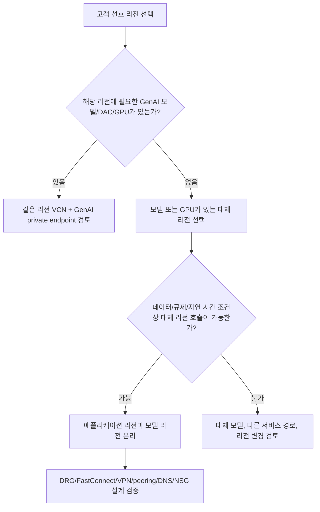

# GenAI / DAC / GPU 미지원 리전의 Private Endpoint 아키텍처 가이드

이 별첨은 원하는 OCI 리전에서 Generative AI 모델, Dedicated AI Cluster, Data Science GPU, IaaS GPU가 보이지 않을 때 검토할 수 있는 네트워크 아키텍처를 정리합니다.

중요한 기준은 다음과 같습니다.

- Private endpoint는 미지원 리전에 모델이나 GPU capacity를 새로 만들지 않습니다.
- Private endpoint는 지원 리전에 있는 Generative AI endpoint를 VCN 안에서 private하게 접근하기 위한 네트워크 경로입니다.
- 모델 availability, DAC unit availability, IaaS/Data Science GPU capacity, service limit, quota는 private endpoint와 별도로 확인해야 합니다.
- 애플리케이션 리전과 모델 제공 리전을 분리하면 데이터 경로, 지연 시간, 규제, 운영 책임을 별도로 검토해야 합니다.

---

## 1. 먼저 구분해야 할 문제

| 고객 질문 | Private endpoint로 해결 가능 | 별도 확인 필요 |
|---|---|---|
| 인터넷을 거치지 않고 GenAI endpoint를 호출하고 싶습니다. | 가능 | VCN, subnet, NSG, route, DNS |
| 내 리전에 원하는 GenAI 모델이 없습니다. | 불가 | 모델이 지원되는 리전 선택 |
| 내 리전에 DAC unit이 없습니다. | 불가 | DAC 지원 리전, capacity, limit |
| 내 리전에 GPU shape가 보이지 않습니다. | 불가 | Data Science/IaaS GPU 지원 리전, quota, capacity |
| 앱은 한국 리전에 두고 모델은 다른 리전에서 쓰고 싶습니다. | 일부 가능 | cross-region network, latency, data residency |
| 온프레미스에서 private하게 호출하고 싶습니다. | 일부 가능 | FastConnect/VPN/DRG, DNS, 보안 정책 |

---

## 2. 권장 판단 흐름

Mermaid가 보이지 않는 환경에서는 아래 표로 판단합니다.

| 상황 | 1차 권장 |
|---|---|
| 같은 리전에 모델과 네트워크가 모두 있습니다. | 같은 리전 private endpoint 구성을 우선 검토합니다. |
| 앱 리전에는 모델이 없고 다른 리전에 모델이 있습니다. | 앱 리전과 모델 리전을 분리하고 네트워크/지연 시간/규제를 검토합니다. |
| 모델 리전은 있으나 DAC/GPU capacity가 불확실합니다. | service limit, quota, capacity 확인을 먼저 수행합니다. |
| 데이터가 리전 밖으로 나가면 안 됩니다. | 해당 리전에 지원되는 모델/서비스만 사용하거나 다른 아키텍처를 검토합니다. |

---

## 3. 패턴 A: 같은 리전 VCN에서 GenAI private endpoint 접근

| 항목 | 내용 |
|---|---|
| 적합한 경우 | 애플리케이션과 GenAI 모델 endpoint가 같은 리전에 있고, public internet 경로를 피하고 싶을 때 |
| 구성 | VCN, private subnet, NSG/security list, Generative AI private endpoint, 애플리케이션 워크로드 |
| 해결하는 것 | private network 기반 접근, 보안 경계 단순화 |
| 해결하지 못하는 것 | 미지원 모델 추가, DAC capacity 확보, GPU 재고 확보 |
| 확인할 것 | 모델 리전 지원, private endpoint lifecycle, DNS/route, IAM policy, endpoint 호출 테스트 |

이 패턴은 가장 단순합니다. 모델과 애플리케이션이 같은 리전에 있으므로 지연 시간과 데이터 이동 해석이 비교적 명확합니다.

---

## 4. 패턴 B: 앱 리전과 모델 리전 분리

| 항목 | 내용 |
|---|---|
| 적합한 경우 | 고객 선호 리전에 모델/DAC/GPU가 없고, 다른 리전의 GenAI endpoint를 사용할 수 있을 때 |
| 구성 | 앱 리전 VCN, 모델 리전 VCN, 모델 리전 private endpoint, 리전 간 네트워크 연결 |
| 해결하는 것 | 고객 앱은 선호 리전에 유지하면서 지원 리전의 모델 사용 |
| 해결하지 못하는 것 | 데이터 residency 요구가 강한 경우, 미지원 리전 내 모델 생성 |
| 확인할 것 | cross-region latency, egress/cost, DNS resolution, routing, DRG/peering 가능성, 보안 정책 |

이 패턴은 고객에게 반드시 “리전 분리”를 명시해야 합니다. 앱이 있는 리전에서 모델이 실행되는 것이 아니라, 모델이 지원되는 리전으로 호출 경로를 구성하는 방식입니다.

---

## 5. 패턴 C: 온프레미스 또는 외부망에서 private 경로로 접근

| 항목 | 내용 |
|---|---|
| 적합한 경우 | 온프레미스 업무 시스템이 OCI GenAI endpoint를 private하게 호출해야 할 때 |
| 구성 | 온프레미스 네트워크, FastConnect 또는 VPN, DRG, VCN, GenAI private endpoint |
| 해결하는 것 | 공용 인터넷 노출 최소화, 기업망 통제 유지 |
| 해결하지 못하는 것 | 모델 리전 미지원, GPU capacity 부족 |
| 확인할 것 | DNS forwarding, route table, NSG/security list, DRG attachment, MTU, latency, 장애 대응 |

이 패턴에서는 네트워크 운영팀과 보안팀 검토가 필수입니다. 모델이 있는 리전, 데이터가 이동하는 경로, 로그와 감사 범위를 명확히 기록해야 합니다.

---

## 6. 고객 안내 문구

고객에게는 아래 표현을 그대로 쓰는 편이 안전합니다.

| 표현 | 사용 여부 |
|---|---|
| Private endpoint를 쓰면 미지원 리전에서도 모델을 사용할 수 있습니다. | 사용하지 않습니다. 오해 소지가 큽니다. |
| Private endpoint는 지원 리전에 있는 GenAI endpoint를 private network로 접근하는 방식입니다. | 사용합니다. |
| 모델 지원 여부와 private access 여부는 별도 확인 항목입니다. | 사용합니다. |
| shape가 보이면 즉시 GPU를 만들 수 있습니다. | 사용하지 않습니다. |
| shape 가시성은 capacity, quota, service limit 보장이 아닙니다. | 사용합니다. |

---

## 7. 체크리스트

| 구분 | 확인 항목 |
|---|---|
| 모델 | 대상 모델이 어느 리전에서 on-demand 또는 dedicated로 지원되는지 확인 |
| DAC | 필요한 DAC unit이 해당 리전에 있는지 확인 |
| GPU | Data Science/IaaS shape 가시성과 service limit, quota, capacity 확인 |
| 네트워크 | VCN, subnet, route, NSG/security list, DNS, DRG/FastConnect/VPN 확인 |
| 보안 | IAM policy, compartment 경계, 로그/감사, 데이터 이동 경로 확인 |
| 운영 | latency, 장애 시 대체 경로, 변경 관리, 비용 확인 |

---

## 8. 최종 원칙

Private endpoint는 좋은 보안 아키텍처 구성 요소입니다. 그러나 리전별 모델 availability나 GPU capacity를 대체하지 않습니다. 따라서 이 가이드는 항상 리전 스냅샷 UI, Oracle 공식 Models by Region 문서, service limit/quota/capacity 확인과 함께 사용해야 합니다.
