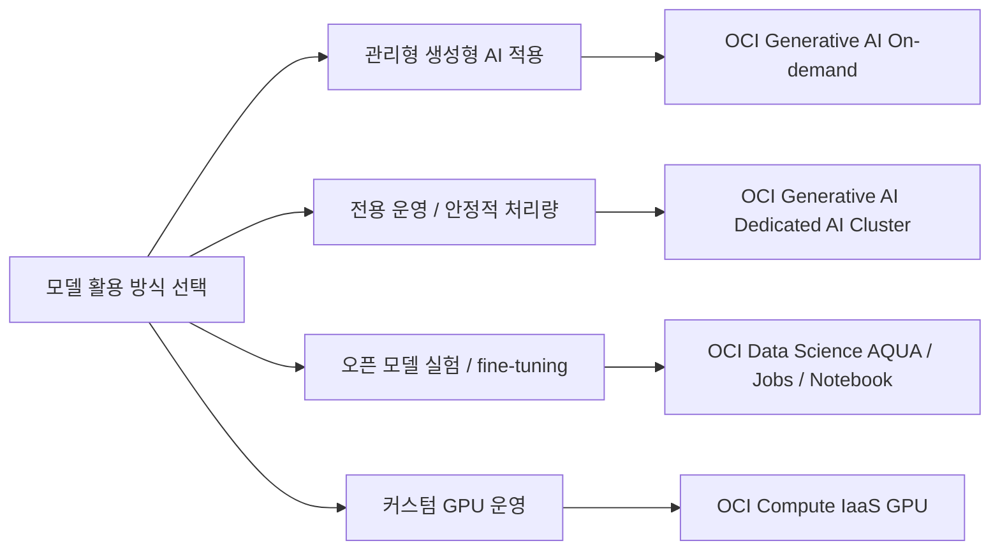
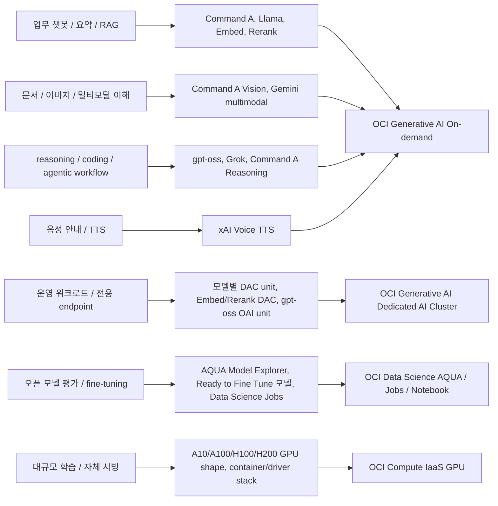

# OCI Generative AI / DAC / AQUA / IaaS GPU 리전 및 모델 가이드 v3

> 리전별 실측 스냅샷 UI: [catalog.html](catalog.html)
> Private endpoint 별첨: [appendix/private-endpoint-architecture.md](appendix/private-endpoint-architecture.md)

최신 작성일: 2026-05-19 (GMT)  
작성 기준: Oracle 공식 문서 우선, 고객용 probe summary와 정규화 JSON 우선, 대표 리전 GPU 조회 결과 보조

이 문서는 OCI Generative AI 모델을 어느 리전에서 어떤 방식으로 사용할지, 전용 클러스터가 필요한지, GPU를 직접 써야 하는지 판단하기 위한 고객용 가이드입니다. v3에서는 `On-demand`, `Dedicated AI Cluster`, `AQUA / Data Science`, `IaaS GPU`의 4대 선택 범주를 먼저 설명하고, 리전/가용성/검증 근거는 뒤쪽에서 확인하도록 재배열했습니다.

리전별 스냅샷을 화면에서 필터링하려면 `docs/catalog.html`을 함께 보시면 됩니다. 네트워크 보안 설계는 `docs/appendix/private-endpoint-architecture.md` 별첨을 참고하시면 됩니다. 단, private endpoint는 미지원 리전에 모델이나 GPU capacity를 생성하는 기능이 아닙니다. private endpoint는 지원 리전에 있는 Generative AI endpoint를 private network로 접근하는 패턴입니다.

---

## 1. 처음 읽는 분을 위한 요약

### 서비스 선택 흐름

### 워크로드별 추천 아키텍처

| 워크로드 / 목표 | 대표 모델/기능 조합 | 적용 Oracle 경로 |
|---|---|---|
| 업무 챗봇 / 요약 / RAG | Command A, Llama, Embed, Rerank | OCI Generative AI On-demand |
| 문서 / 이미지 / 멀티모달 이해 | Command A Vision, Gemini multimodal | OCI Generative AI On-demand |
| reasoning / coding / agentic workflow | gpt-oss, Grok, Command A Reasoning | OCI Generative AI On-demand |
| 음성 안내 / TTS | xAI Voice TTS | OCI Generative AI On-demand |
| 운영 워크로드 / 전용 endpoint | 모델별 DAC unit, Embed/Rerank DAC, gpt-oss OAI unit | OCI Generative AI Dedicated AI Cluster |
| 오픈 모델 평가 / fine-tuning | AQUA Model Explorer, Ready to Fine Tune 모델, Data Science Jobs | OCI Data Science AQUA / Jobs / Notebook |
| 대규모 학습 / 자체 서빙 | A10/A100/H100/H200 GPU shape, container/driver stack | OCI Compute IaaS GPU |

| 질문 | 짧은 답 |
|---|---|
| 관리형 모델을 바로 쓰고 싶습니다. | 먼저 `On-demand` 모델을 검토합니다. 별도 GPU 운영 없이 API로 사용하는 방식입니다. |
| 안정적인 처리량이나 전용 endpoint가 필요합니다. | `Dedicated AI Cluster`를 검토합니다. 다만 DAC에 올릴 수 있다고 해서 항상 fine-tuning이 가능한 것은 아닙니다. |
| Hugging Face/open model을 실험하거나 fine-tuning하고 싶습니다. | `AQUA` 또는 `OCI Data Science Jobs/Notebook` 경로가 자연스럽습니다. |
| GPU 서버와 프레임워크를 직접 운영하고 싶습니다. | `OCI Compute IaaS GPU`를 사용합니다. 자유도는 높지만 드라이버, 프레임워크, 보안, 분산 학습 운영을 직접 책임져야 합니다. |
| 표에 `지원`이라고 되어 있으면 바로 생성 가능한가요? | 아닙니다. 서비스 지원과 실제 capacity, service limit, quota는 별도 확인이 필요합니다. |

---

## 2. 이번 업데이트 변화 요약

| 구분 | 변화 | 기준일 | 이 문서의 반영 |
|---|---|---:|---|
| 신규 모델 | `xai.grok-tts` 기반 xAI Voice Text to Speech가 추가되었습니다. | 2026-05-15 | 음성 합성 모델로 별도 표에 넣었습니다. |
| import 호환 모델 추가 | `Qwen/Qwen3.6-35B-A3B`, `Qwen/Qwen3.5-9B`, `google/gemma-4-31B-it`가 import 호환 모델에 추가되었습니다. | 2026-05-11 | imported model 권장 DAC 표에 넣었습니다. |
| 신규 모델 | `cohere.rerank-v4.0-pro`, `cohere.rerank-v4.0-fast`가 Cohere Rerank 4.0으로 확인됩니다. | 2026-05-09 | 전용 DAC `RERANK_COHERE x1`로 넣었습니다. release notes는 on-demand와 dedicated를 함께 언급하지만, 개별 모델 페이지는 dedicated only라고 설명하므로 mode는 문서 간 상충으로 표시했습니다. |
| 기능 확장 | Cohere Embed 4가 configurable output dimensions와 text+image `EmbedText` payload를 지원합니다. | 2026-05-09 | 임베딩 모델 강점과 DAC 표에 반영했습니다. |
| 리전 추가 | OCI Generative AI가 UAE Central (Abu Dhabi) 리전에서 사용 가능해졌습니다. | 2026-05-05 | 서비스 가용성 표에 넣었습니다. 다만 A10/A100/H100/H200 전용 DAC 공개표에는 확인되지 않아 `문서상 미확인`으로 표시했습니다. |
| retired / replacement | Oracle retirement 문서 기준으로 Grok 3 계열과 일부 구형 Cohere / Meta 모델은 신규 설계에서 우선 제외하는 편이 안전합니다. | 2026-05-19 확인 | retired / deprecated 메모와 빠른 추천에서 제외했습니다. |
| 대표 리전 GPU 조회 | 대표 리전의 IaaS GPU shape 조회가 성공했습니다. | 2026-05-19 | IaaS/AQUA 해석 표에 반영했습니다. |
| AI catalog 공개 JSON | 43개 리전 행을 포함한 공개 스냅샷을 생성했습니다. | 2026-05-19 | `docs/catalog.html`에서 리전별 모델/shape 가시성과 조회 상태를 표로 확인할 수 있습니다. |

핵심 변화는 `Cohere Rerank 4.0`, `Cohere Embed 4 기능 확장`, `xAI Voice`, `Abu Dhabi 리전`, `import 호환 모델 3개 추가`, `대표 리전 GPU 조회 성공 결과 반영`, `AI catalog 공개 JSON 생성`입니다.

---

## 3. 선택 기준과 용어

### 3-1. 해석 원칙

| 원칙 | 적용 방식 |
|---|---|
| Oracle 공식 문서 우선 | 모델 리전, DAC unit, shape 사양, AQUA 지원 범위는 Oracle 공식 문서를 1순위로 사용했습니다. |
| 사전 수집 결과 우선 | OCI CLI는 이 문서 작성 중 재실행하지 않았습니다. 고객용 probe summary와 정규화 JSON이 있으면 이를 먼저 사용했습니다. |
| 대표 리전 실조회 보조 | 대표 리전의 IaaS GPU shape 조회 결과를 보조 근거로 사용했습니다. |
| 공개 catalog 상태 반영 | AI catalog 공개 JSON은 43개 리전 행을 포함합니다. 단, API별 success/failed/timeout 상태를 함께 표시하므로 공식 지원과 capacity 보장으로 단정하지 않습니다. |
| 추정 금지 | Oracle 문서에 없는 리전별 실시간 재고, generic/cohere DAC의 실제 GPU 종류, GPU 메모리는 단정하지 않았습니다. |
| 관리형 기본 모델과 imported model 분리 | Oracle 관리형 기본 모델의 dedicated cluster unit과 사용자가 import한 모델의 권장 DAC를 별도로 다루었습니다. |
| 표 폭 제한 | 리전, 모델, GPU, 조회 상태를 여러 표로 나눴습니다. |

---

### 3-2. 용어 빠른 설명

| 용어 | 쉬운 설명 |
|---|---|
| 리전 | OCI 서비스를 사용할 물리적 지역입니다. 예: Ashburn, Frankfurt, Seoul. |
| 온디맨드 | 전용 클러스터 없이 API로 바로 호출하는 모델 사용 방식입니다. |
| Dedicated / DAC | 특정 모델을 전용 용량으로 운영하기 위한 전용 AI 클러스터입니다. 안정적인 처리량이나 전용 endpoint가 필요할 때 검토합니다. |
| AQUA | OCI Data Science의 AI Quick Actions입니다. 오픈 모델을 빠르게 배포, 평가, fine-tuning하는 데 사용합니다. |
| IaaS GPU | GPU VM/BM을 직접 만들어 사용하는 방식입니다. 운영 자유도는 높지만 관리 책임도 큽니다. |
| Shape | OCI에서 CPU, 메모리, GPU 구성을 나타내는 서버 규격 이름입니다. |
| GPU family | A10, A100, H100, H200처럼 GPU 세대를 구분하는 이름입니다. |
| Service limit / quota | 계정 또는 compartment에서 만들 수 있는 리소스 한도입니다. |
| Capacity | 특정 리전과 AD에 실제로 남아 있는 물리적 자원입니다. |
| Fine-tuning | 기존 모델을 특정 데이터로 추가 학습해 업무에 맞게 조정하는 작업입니다. |
| Imported model | Hugging Face 또는 Object Storage에서 가져와 OCI에 배포하는 모델입니다. |

---

### 3-3. 고객이 자주 오해하는 기준

| 표현 | 이 문서의 의미 |
|---|---|
| `지원` | Oracle 문서상 서비스 또는 모델을 사용할 수 있다는 의미입니다. 실제 생성 가능 여부와 다를 수 있습니다. |
| `shape 가시성` | `compute shape list`에서 shape가 보였다는 의미입니다. capacity 수량이나 생성 성공을 보장하지 않습니다. |
| `DAC hosting 가능` | dedicated endpoint로 운영할 수 있다는 의미입니다. fine-tuning 가능과 같지 않습니다. |
| `AQUA 가능` | Data Science/AQUA 경로를 검토할 수 있다는 의미입니다. 리전별 GPU 재고 보장이 아닙니다. |
| `fine-tuning 가능` | 해당 서비스/모델 조합에서 추가 학습 workflow가 지원된다는 의미입니다. imported model hosting과 구분해야 합니다. |

---

## 4. 4대 서비스 선택 가이드

| 선택 범주 | 적합한 경우 | 대표 모델/기능 조합 | 운영 책임 / 확인 항목 |
|---|---|---|---|
| OCI Generative AI On-demand | 빠른 PoC, 업무 챗봇, 요약, RAG, 멀티모달, TTS | Command A, Llama, Gemini, gpt-oss, Embed, Rerank, xAI Voice | 모델 리전 지원, external call 성격, 사용량/비용 확인 |
| OCI Generative AI Dedicated AI Cluster | 운영 워크로드, 전용 endpoint, 예측 가능한 성능 | Command A DAC, Llama DAC, gpt-oss OAI unit, Embed/Rerank DAC | 모델별 DAC unit, service limit, quota, capacity 확인 |
| OCI Data Science AQUA / Jobs / Notebook | Hugging Face/open model 평가, 배포, fine-tuning | AQUA Model Explorer, Ready to Fine Tune 모델, Data Science Jobs | Data Science 지원 shape, Object Storage, Job 설정, GPU limit 확인 |
| OCI Compute IaaS GPU | 자체 프레임워크, 대규모 학습/서빙, 세밀한 GPU 제어 | A10/A100/H100/H200 GPU shape, container/driver stack | 드라이버, 컨테이너, 보안, 분산 학습, 패치 운영 책임 |

---

## 5. On-demand 모델 활용

On-demand는 별도 GPU 서버나 전용 클러스터를 먼저 운영하지 않고 OCI Generative AI API로 모델을 호출하는 기본 경로입니다. 빠른 PoC, 업무 챗봇, 요약, RAG, 멀티모달, TTS처럼 관리형 API 사용이 우선인 경우 먼저 검토합니다.

### 5-1. 범용 / 추론 / 멀티모달

| 모델 | 유형 | 온디맨드 | 파인튜닝 | 강점 |
|---|---|---|---|---|
| `cohere.command-a-03-2025` | 범용 chat / agent | 리전별 지원 | 불가 | 기업형 RAG, tool use, multilingual 업무에 적합합니다. |
| `cohere.command-a-vision` | 멀티모달 | 리전별 지원 | 불가 | 문서, 차트, 이미지 해석에 적합합니다. |
| `cohere.command-a-reasoning` | reasoning | 리전별 지원 | 불가 | 복합 추론과 장문 업무에 적합합니다. |
| `meta.llama-3.3-70b-instruct` | 범용 instruct | 리전별 지원 | 가능 | OCI 관리형 fine-tuning 대상입니다. |
| `openai.gpt-oss-20b` | reasoning / coding | 리전별 지원 | 불가 | 빠른 reasoning, 코딩, STEM 업무에 적합합니다. |
| `openai.gpt-oss-120b` | reasoning | 리전별 지원 | 불가 | 더 높은 reasoning 품질을 우선할 때 적합합니다. |
| `google.gemini-2.5-pro` | 멀티모달 reasoning | 리전별 지원 | 불가 | 가장 어려운 멀티모달 문제와 대형 입력에 적합합니다. |
| `google.gemini-2.5-flash` | 멀티모달 fast | 리전별 지원 | 불가 | 속도와 품질 균형이 필요한 경우에 적합합니다. |
| `google.gemini-2.5-flash-lite` | 경량 멀티모달 | 리전별 지원 | 불가 | 대량 처리와 비용 최적화에 적합합니다. |

### 5-2. 임베딩 / 재정렬 / 음성 / 코딩

| 모델 | 유형 | 온디맨드 | 파인튜닝 | 강점 |
|---|---|---|---|---|
| `cohere.embed-v4.0` | 임베딩 | 리전별 지원 | 불가 | 텍스트, 이미지, text+image payload, 256/512/1024/1536 차원 출력을 지원합니다. |
| `cohere.rerank-v4.0-pro` | 재정렬 | 문서 간 상충 | 불가 | 품질 중심의 multilingual / semi-structured reranking에 적합합니다. |
| `cohere.rerank-v4.0-fast` | 재정렬 | 문서 간 상충 | 불가 | 낮은 지연과 높은 처리량이 필요한 reranking에 적합합니다. |
| `xAI Grok 4.20` | reasoning / tool use | 리전별 지원 | 불가 | external API tool use 워크플로에 적합합니다. |
| `xAI Grok Code Fast 1` | 코딩 | 리전별 지원 | 불가 | agentic coding과 tool-use 중심 작업에 적합합니다. |
| `xai.grok-tts` | Text to Speech | 리전별 지원 | 불가 | 텍스트를 음성으로 변환하는 워크로드에 적합합니다. |

메모:

- 파인튜닝 가능 표시는 신규 설계에서 우선 검토할 현행 모델 기준입니다. Oracle 문서상 `cohere.command-r-08-2024`도 fine-tuning 가능하지만 deprecated 모델이므로 5번 On-demand 모델 활용 섹션에서는 제외했습니다.
- `cohere.rerank-v4.0-pro`와 `cohere.rerank-v4.0-fast`는 Oracle release notes에서 on-demand와 dedicated를 함께 언급하지만, 개별 모델 페이지는 dedicated mode only라고 설명합니다. 이 문서는 둘을 조정해 `문서 간 상충`으로 표시했습니다.
- Google Gemini 모델은 Oracle 문서상 external call 주의가 있습니다.
- xAI Grok 모델은 OCI data center 안의 xAI 전용 운영 환경에서 xAI가 관리하는 모델로 설명되어 있습니다.

---

## 6. Dedicated AI Cluster 활용

Dedicated AI Cluster는 전용 용량과 endpoint가 필요한 운영 워크로드를 위한 선택지입니다. 모델별 dedicated unit을 기준으로 판단해야 하며, DAC hosting 가능 여부와 fine-tuning 가능 여부를 구분해야 합니다.

DAC는 전용 용량으로 모델을 운영하기 위한 선택지입니다. 안정적인 처리량, 전용 endpoint, 장기 운영이 필요할 때 검토합니다. 다만 `DAC hosting 가능`이 `fine-tuning 가능`을 뜻하지는 않습니다.

### 6-1. 관리형 기본 모델용 DAC

| 모델 | 대표 DAC unit | 파인튜닝 | 메모 |
|---|---|---|---|
| `cohere.command-a-03-2025` | `LARGE_COHERE_V3 x1` | 불가 | Dubai는 `SMALL_COHERE_4`가 보입니다. |
| `cohere.command-a-vision` | `LARGE_COHERE_V3 x1` | 불가 | 일부 리전은 on-demand와 dedicated가 함께 보입니다. |
| `cohere.command-a-reasoning` | `LARGE_COHERE_V2_2 x1` | 불가 | reasoning 전용 Cohere 모델입니다. |
| `cohere.embed-v4.0` | `EMBED_COHERE x1` | 불가 | 임베딩 전용 DAC입니다. |
| `cohere.rerank-v4.0-pro` | `RERANK_COHERE x1` | 불가 | 개별 모델 페이지 기준 dedicated cluster unit은 명확합니다. |
| `cohere.rerank-v4.0-fast` | `RERANK_COHERE x1` | 불가 | 개별 모델 페이지 기준 dedicated cluster unit은 명확합니다. |
| `meta.llama-3.3-70b-instruct` | `Large Generic x1` hosting, `x2` fine-tuning | 가능 | 관리형 fine-tuning 대상입니다. |
| `meta.llama-4-scout-17b-16e-instruct` | `Large Generic V2 x1` | 불가 | 긴 문맥과 작은 GPU footprint가 특징입니다. |
| `meta.llama-4-maverick-17b-128e-instruct-fp8` | `Large Generic 2 x1` | 불가 | 초장문과 coding/reasoning에 적합합니다. |
| `openai.gpt-oss-20b` | `OAI_A10_X2`, `OAI_A100_40G_X1`, `OAI_A100_80G_X1`, `OAI_H100_X1`, `OAI_H200_X1` | 불가 | 공개 GPU 계열이 가장 명확합니다. |
| `openai.gpt-oss-120b` | `OAI_A100_40G_X4`, `OAI_A100_80G_X2`, `OAI_H100_X2`, `OAI_H200_X1` | 불가 | 더 큰 reasoning 모델입니다. |

파인튜닝 가능 표시는 신규 설계에서 우선 검토할 현행 DAC 중심 모델 기준입니다. Oracle 문서상 `cohere.command-r-08-2024` 등도 fine-tuning 가능 표기가 있지만 deprecated 또는 retired 축에 가까우므로 6번 Dedicated AI Cluster 활용 섹션에서는 제외했습니다.

`openai.gpt-oss-20b`와 `openai.gpt-oss-120b`는 dedicated AI cluster hosting은 가능하지만, Oracle 개별 모델 문서 기준 fine-tuning 대상은 아닙니다.

### 6-2. DAC 중심으로 보는 이유

| 모델 | DAC 관점의 의미 |
|---|---|
| Cohere Command A 계열 | Oracle이 Cohere 전용 unit을 제공하지만 GPU 종류는 공개하지 않습니다. |
| Cohere Embed / Rerank | 검색/RAG 파이프라인의 핵심 구성요소를 전용 용량으로 고정할 수 있습니다. |
| Meta Llama 3.3 70B | 관리형 fine-tuning과 hosting을 모두 고려할 수 있습니다. |
| Meta Llama 4 Scout / Maverick | dedicated 중심으로 보이며 generic unit을 사용합니다. |
| OpenAI gpt-oss 20b / 120b | A10/A100/H100/H200 family가 unit 이름에 드러납니다. |

---

### 6-3. GPU 메모리를 계산할 수 있는 DAC unit

| DAC unit | GPU 해석 | 총 GPU 메모리 |
|---|---|---:|
| `A10_X1` | 1x A10 | 24 GB |
| `A10_X2` | 2x A10 | 48 GB |
| `A10_X4` | 4x A10 | 96 GB |
| `A100_40G_X1` | 1x A100 40G | 40 GB |
| `A100_40G_X2` | 2x A100 40G | 80 GB |
| `A100_40G_X4` | 4x A100 40G | 160 GB |
| `A100_40G_X8` | 8x A100 40G | 320 GB |
| `A100_80G_X1` | 1x A100 80G | 80 GB |
| `A100_80G_X2` | 2x A100 80G | 160 GB |
| `A100_80G_X4` | 4x A100 80G | 320 GB |
| `A100_80G_X8` | 8x A100 80G | 640 GB |
| `H100_X1` | 1x H100 | 80 GB |
| `H100_X2` | 2x H100 | 160 GB |
| `H100_X4` | 4x H100 | 320 GB |
| `H100_X8` | 8x H100 | 640 GB |
| `H200_X1` | 1x H200 | 141 GB |
| `H200_X2` | 2x H200 | 282 GB |
| `H200_X4` | 4x H200 | 564 GB |
| `H200_X8` | 8x H200 | 1128 GB |

### 6-4. OpenAI gpt-oss 전용 OAI unit

| DAC unit | GPU 해석 | 총 GPU 메모리 |
|---|---|---:|
| `OAI_A10_X2` | 2x A10 | 48 GB |
| `OAI_A100_40G_X1` | 1x A100 40G | 40 GB |
| `OAI_A100_40G_X4` | 4x A100 40G | 160 GB |
| `OAI_A100_80G_X1` | 1x A100 80G | 80 GB |
| `OAI_A100_80G_X2` | 2x A100 80G | 160 GB |
| `OAI_H100_X1` | 1x H100 | 80 GB |
| `OAI_H100_X2` | 2x H100 | 160 GB |
| `OAI_H200_X1` | 1x H200 | 141 GB |

### 6-5. GPU 메모리를 단정할 수 없는 DAC unit

| DAC unit | GPU 타입 | GPU 메모리 | 이유 |
|---|---|---|---|
| `SMALL_COHERE_4` | 미공개 | 미공개 | Oracle 문서가 underlying GPU를 공개하지 않습니다. |
| `LARGE_COHERE_V2_2` | 미공개 | 미공개 | 동일합니다. |
| `LARGE_COHERE_V3` | 미공개 | 미공개 | 동일합니다. |
| `EMBED_COHERE` | 미공개 | 미공개 | 동일합니다. |
| `RERANK_COHERE` | 미공개 | 미공개 | 동일합니다. |
| `SMALL_GENERIC_V2` | 미공개 | 미공개 | 동일합니다. |
| `LARGE_GENERIC` | 미공개 | 미공개 | 동일합니다. |
| `LARGE_GENERIC_2` | 미공개 | 미공개 | 동일합니다. |
| `LARGE_GENERIC_V1` | 미공개 | 미공개 | 동일합니다. |
| `LARGE_GENERIC_V2` | 미공개 | 미공개 | 동일합니다. |
| `LARGE_GENERIC_V4` | 미공개 | 미공개 | 동일합니다. |
| `LARGE_GENERIC_V5` | 미공개 | 미공개 | 동일합니다. |

---

## 7. AQUA / Data Science 활용

AQUA와 Data Science는 오픈 모델을 실험, 배포, 평가, fine-tuning하는 경로입니다. OCI Generative AI On-demand나 DAC처럼 모델 API만 호출하는 방식이 아니라, Data Science 리소스와 GPU shape, Object Storage, Job/Notebook 설정을 함께 봐야 합니다.

| 활용 항목 | 해석 |
|---|---|
| 오픈 모델 평가 | AQUA Model Explorer에서 제공 모델을 빠르게 검토하는 경로입니다. |
| Hugging Face/open model fine-tuning | AQUA의 `Ready to Fine Tune` 모델 또는 Data Science Jobs/Notebook을 사용합니다. |
| Data Science Jobs / Notebook | Transformers/TRL/PEFT 등 사용자가 선택한 학습 스택을 직접 운영할 수 있습니다. |
| Model Deployment / AI platform | 사내 AI 플랫폼 형태로 endpoint 운영 표준화가 필요할 때 Data Science Model Deployment를 함께 검토합니다. |
| GPU 확인 | AQUA 지원이 리전별 GPU 재고 보장을 뜻하지 않으므로 Data Science 지원 shape, limit, capacity를 별도로 확인합니다. |

### 7-1. AQUA 해석 기준

| 리전 | IaaS 조회에서 보인 GPU 계열 | AQUA 해석 |
|---|---|---|
| `us-ashburn-1` | P100, V100, A10, A100 | Data Science/AQUA에서 GPU shape 선택 가능성을 검토할 대표 리전입니다. 단, 실제 생성 가능 여부는 별도 확인이 필요합니다. |
| `us-phoenix-1` | A10, A100 | Data Science/AQUA에서 GPU shape 선택 가능성을 검토할 대표 리전입니다. 단, 실제 생성 가능 여부는 별도 확인이 필요합니다. |
| `eu-frankfurt-1` | P100, A10, A100 | 유럽 대표 리전으로, AQUA 사용 전 Data Science 지원 shape와 service limit을 확인해야 합니다. |
| `uk-london-1` | V100, A10 | 유럽/영국권 대표 리전으로, AQUA 사용 전 Data Science 지원 shape와 service limit을 확인해야 합니다. |
| `ap-seoul-1` | V100, A10, A100 | 한국 운영 관심 리전으로, AQUA 사용 전 Data Science 지원 shape와 service limit을 확인해야 합니다. |
| `ap-osaka-1` | V100, A10, A100 | 일본 운영 관심 리전으로, AQUA 사용 전 Data Science 지원 shape와 service limit을 확인해야 합니다. |
| `me-dubai-1` | A10 | 중동 대표 리전으로, AQUA 사용 전 Data Science 지원 shape와 service limit을 확인해야 합니다. |
| `me-riyadh-1` | 없음 | IaaS 조회 결과가 비어 있지만, AQUA 실재고 없음으로 단정하지 않습니다. Console/limit/capacity 확인이 필요합니다. |
| `me-abudhabi-1` | 없음 | IaaS 조회 결과가 비어 있지만, AQUA 실재고 없음으로 단정하지 않습니다. Console/limit/capacity 확인이 필요합니다. |

### 7-2. IaaS / AQUA 일반 해석

| 항목 | 해석 |
|---|---|
| IaaS GPU 재고 | 위 표는 `compute shape list`의 shape 가시성입니다. 실제 capacity 수량 또는 생성 보장을 뜻하지 않습니다. |
| AQUA GPU 재고 | Oracle 공식 문서는 AQUA의 리전별 GPU 실재고표를 제공하지 않습니다. |
| AQUA shape 기준 | AQUA는 Data Science가 지원하는 GPU를 사용할 수 있습니다. |
| GPU 예약 이전 | Data Science 문서는 Compute GPU reservation을 Data Science로 이전하는 support request 절차를 설명합니다. |
| 리야드/아부다비 | 이번 조회 명령은 성공했지만 GPU shape 목록이 비어 있었습니다. 실패가 아니라 빈 결과입니다. |

### 7-3. 운영 확인 체크리스트

| 확인 항목 | 이유 |
|---|---|
| Service Limits | shape가 보여도 limit이 0이면 생성할 수 없습니다. |
| Availability Domain | GPU capacity는 AD별로 달라질 수 있습니다. |
| Quota / Compartment 정책 | 서비스 한도와 compartment quota가 모두 영향을 줍니다. |
| Reservation | 대형 GPU는 예약 또는 capacity 협의가 필요할 수 있습니다. |
| Data Science 전환 | AQUA/Data Science에서 쓰려면 Data Science 지원 shape와 reservation 이전 절차를 함께 확인해야 합니다. |

정리하면, 이 표는 `어떤 리전에서 어떤 GPU 계열을 검토할 수 있는지`를 보여줍니다. `바로 생성 가능`, `예약 가능`, `AQUA에서 즉시 사용 가능`을 보장하는 표는 아닙니다.

---

## 8. IaaS GPU 활용

IaaS GPU는 GPU VM/BM을 직접 만들어 프레임워크, 드라이버, 컨테이너, 보안, 분산 학습/서빙 스택을 직접 운영하는 경로입니다. 자유도는 가장 높지만 운영 책임도 가장 큽니다.

### 8-1. 사전 조회 범위

이 리포트 작성 중 OCI CLI를 다시 실행하지 않았습니다. 2026-05-19에 사전 수집된 고객용 summary와 정규화 JSON을 기준으로, 구독 리전 43개가 READY 상태임을 확인했습니다.

IaaS/AQUA 비교용 GPU shape 가시성은 아래 대표 리전 샘플을 기준으로 해석했습니다. 이 범위는 전체 리전의 실시간 capacity 조사가 아니라, 고객 설계 논의에 필요한 대표 권역 비교용입니다.

| 권역 | 대표 리전 |
|---|---|
| 미국 | `us-ashburn-1`, `us-phoenix-1` |
| 유럽 | `eu-frankfurt-1`, `uk-london-1` |
| 한국/일본 | `ap-seoul-1`, `ap-osaka-1` |
| 중동 | `me-dubai-1`, `me-riyadh-1`, `me-abudhabi-1` |

### 8-2. 결과 해석법

| 조회 결과 | 해석 |
|---|---|
| 표에 shape가 표시됨 | 해당 고객 환경, compartment, region의 `compute shape list` API에서 그 GPU shape가 보였다는 뜻입니다. 실제 생성 성공은 service limit, quota, capacity, AD별 가용성에 따라 달라질 수 있습니다. |
| `Command returned empty list` | 명령은 성공했지만 GPU shape 목록이 비어 있다는 뜻입니다. 조회 실패로 해석하지 않습니다. |
| 같은 shape가 중복 표시됨 | 원본 API 결과 또는 AD/variant 표시 방식 때문에 중복될 수 있습니다. 재고 수량으로 해석하지 않습니다. |
| 오류 메시지가 없음 | 이번 조회에서는 실패 오류가 없었다고 기록합니다. |

고객 관점에서 중요한 점은 `shape가 보임`이 `지금 바로 생성 가능`을 뜻하지 않는다는 것입니다. 실제 생성 가능 여부는 service limit, quota, capacity, AD별 가용성 확인이 필요합니다.

---

### 8-3. 주요 IaaS / Data Science GPU shape

| Shape | GPU | GPU 수 | 총 GPU 메모리 | OCPU | CPU 메모리 |
|---|---|---:|---:|---:|---:|
| `VM.GPU2.1` | P100 | 1 | 16 GB | 문서/shape별 확인 | 문서/shape별 확인 |
| `BM.GPU2.2` | P100 | 2 | 32 GB | 28 | 192 GB |
| `VM.GPU3.1` | V100 | 1 | 16 GB | 6 | 90 GB |
| `VM.GPU3.2` | V100 | 2 | 32 GB | 12 | 180 GB |
| `VM.GPU3.4` | V100 | 4 | 64 GB | 24 | 360 GB |
| `BM.GPU3.8` | V100 | 8 | 128 GB | 52 | 768 GB |
| `VM.GPU.A10.1` | A10 | 1 | 24 GB | 15 | 240 GB |
| `VM.GPU.A10.2` | A10 | 2 | 48 GB | 30 | 480 GB |
| `BM.GPU.A10.4` / `BM.GPUA10.4` | A10 | 4 | 96 GB | 64 | 1024 GB |
| `BM.GPU4.8` | A100 40G | 8 | 320 GB | 64 | 2048 GB |
| `BM.GPU.B4.8` | A100 | 8 | 문서상 shape 세부 확인 필요 | 문서상 shape 세부 확인 필요 | 문서상 shape 세부 확인 필요 |
| `BM.GPU.A100-v2.8` | A100 80G | 8 | 640 GB | 128 | 2048 GB |
| `BM.GPU.H100.8` | H100 | 8 | 640 GB | 112 | 2048 GB |
| `BM.GPU.H200.8` | H200 | 8 | 1128 GB | 112 | 3072 GB |
| `BM.GPU.L40S.4` / `BM.GPU.L40S-NC.4` | L40S | 4 | 192 GB | 112 | 1024 GB |

### 8-4. GPU 메모리 환산 규칙

| GPU 계열 | GPU당 메모리 | 예시 |
|---|---:|---|
| A10 | 24 GB | `A10_X2` = 48 GB |
| A100 40G | 40 GB | `A100_40G_X4` = 160 GB |
| A100 80G | 80 GB | `A100_80G_X2` = 160 GB |
| H100 | 80 GB | `H100_X4` = 320 GB |
| H200 | 141 GB | `H200_X2` = 282 GB |

주의 사항:

- `BM.GPU.B4.8`은 이번 대표 리전 조회에서 Osaka와 Phoenix에 보였지만, 이 문서의 공식 shape-to-memory 표에서는 Oracle Compute shape 문서에서 확인되는 범위만 확정했습니다.
- Compute 문서와 Data Science 문서는 일부 shape 표기가 다릅니다. 예를 들어 A10 bare metal은 Compute 문서에서 `BM.GPU.A10.4`, Data Science 문서에서 `BM.GPUA10.4`처럼 보일 수 있습니다.

---

### 8-5. 대표 리전 기준 IaaS GPU shape 가시성

| 리전 | 조회 상태 | 보인 GPU 계열 | 보인 shape |
|---|---|---|---|
| `us-ashburn-1` | 성공 | P100, V100, A10, A100 | `BM.GPU2.2`, `VM.GPU2.1`, `BM.GPU3.8`, `VM.GPU3.1`, `VM.GPU3.2`, `VM.GPU3.4`, `VM.GPU.A10.1`, `VM.GPU.A10.2`, `BM.GPU.A10.4`, `BM.GPU4.8` |
| `us-phoenix-1` | 성공 | A10, A100 | `VM.GPU.A10.1`, `VM.GPU.A10.2`, `BM.GPU.A10.4`, `BM.GPU.B4.8` |
| `eu-frankfurt-1` | 성공 | P100, A10, A100 | `BM.GPU2.2`, `VM.GPU2.1`, `VM.GPU.A10.1`, `VM.GPU.A10.2`, `BM.GPU.A10.4`, `BM.GPU4.8`, `BM.GPU.B4.8` |
| `uk-london-1` | 성공 | V100, A10 | `BM.GPU3.8`, `VM.GPU3.1`, `VM.GPU3.2`, `VM.GPU3.4`, `VM.GPU.A10.1`, `VM.GPU.A10.2`, `BM.GPU.A10.4` |
| `ap-seoul-1` | 성공 | V100, A10, A100 | `BM.GPU3.8`, `VM.GPU3.1`, `VM.GPU3.2`, `VM.GPU3.4`, `VM.GPU.A10.1`, `VM.GPU.A10.2`, `BM.GPU.A10.4`, `BM.GPU4.8` |
| `ap-osaka-1` | 성공 | V100, A10, A100 | `BM.GPU.B4.8`, `BM.GPU4.8`, `BM.GPU3.8`, `VM.GPU3.1`, `VM.GPU3.2`, `VM.GPU3.4`, `VM.GPU.A10.1`, `VM.GPU.A10.2`, `BM.GPU.A10.4` |
| `me-dubai-1` | 성공 | A10 | `VM.GPU.A10.1`, `VM.GPU.A10.2`, `BM.GPU.A10.4` |
| `me-riyadh-1` | 성공 | 없음 | `Command returned empty list, no table to display.` |
| `me-abudhabi-1` | 성공 | 없음 | `Command returned empty list, no table to display.` |

### 8-6. A100 / H100 / H200 선택 가이드

| 선택 기준 | A100 80G | H100 | H200 |
|---|---|---|---|
| GPU당 메모리 | 80 GB | 80 GB | 141 GB |
| 8 GPU IaaS 총 메모리 | 640 GB | 640 GB | 1128 GB |
| 관리형 gpt-oss DAC 가시성 | Chicago, Phoenix 중심 | 가장 넓게 보입니다. | Riyadh에서 보입니다. |
| imported model 권장 | 70B급과 32B reasoning에 자주 보입니다. | Llama 4, gpt-oss, 대형 MoE에 자주 보입니다. | 메모리 병목 완화가 우선일 때 검토합니다. |
| 비용/성숙도 관점 | 범용성과 비용 균형 | 처리량과 최신 생태계 균형 | 메모리 여유 최우선 |
| 주의점 | H100/H200 대비 최신 최적화는 제한적일 수 있습니다. | capacity와 limit 확인이 필요합니다. | 리전별 가시성이 좁을 수 있습니다. |

짧은 추천:

- 비용과 범용성 균형을 우선하면 `A100 80G`를 먼저 검토합니다.
- 대형 모델 처리량과 Oracle 관리형 DAC 선택 폭을 우선하면 `H100`을 먼저 검토합니다.
- 컨텍스트, batch, model size 때문에 메모리 여유가 가장 중요하면 `H200`을 검토합니다.

---

## 9. Import / Custom Model 운영

Imported model과 custom deployment는 관리형 기본 모델을 그대로 쓰는 경로가 아니라, compatible model 또는 외부에서 fine-tuned된 모델을 OCI endpoint로 운영하는 경로입니다. 권장 DAC는 hosting 출발점이며 OCI 관리형 fine-tuning 가능 여부를 뜻하지 않습니다.

이 절은 관리형 기본 모델이 아니라 imported model과 custom deployment 기준입니다. 여기서의 권장 DAC는 모델을 `호스팅`하기 위한 시작점이며, OCI가 해당 모델을 직접 fine-tuning해준다는 의미가 아닙니다.

### 9-1. Oracle compatible imported model 기준 권장 DAC

| family / 모델 예시 | 권장 DAC | 해석 |
|---|---|---|
| `openai/gpt-oss-20b` | `H100_X1` | imported gpt-oss 소형 reasoning 시작점입니다. |
| `openai/gpt-oss-120b` | `H100_X2` | imported gpt-oss 대형 reasoning 시작점입니다. |
| `deepseek-ai/DeepSeek-R1-Distill-Qwen-32B` | `A100_80G_X2` | 32B reasoning 계열에 적합합니다. |
| `meta-llama/Llama-4-Scout-17B-16E-Instruct` | `H100_X4` | 멀티모달, 장문, MoE 특성을 고려한 권장입니다. |
| `meta-llama/Llama-4-Maverick-17B-128E-Instruct-FP8` | `H100_X8` | 더 큰 MoE 및 긴 문맥용 권장입니다. |
| `meta-llama/Llama-3.3-70B-Instruct` | `A100_80G_X4` | 범용 70B imported 모델 출발점입니다. |
| `Qwen/QwQ-32B` | `A100_80G_X2` | reasoning 계열입니다. |
| `Qwen/Qwen3.6-35B-A3B` | `H100_X2` | 2026-05-11 신규 import 호환 모델입니다. Alibaba compatible model 페이지 기준입니다. |
| `Qwen/Qwen3.5-9B` | `H100_X1` | 2026-05-11 신규 import 호환 모델입니다. Alibaba compatible model 페이지 기준입니다. |
| `google/gemma-4-31B-it` | `H100_X2` | 2026-05-11 신규 import 호환 모델입니다. Google compatible model 페이지 기준입니다. |

### 9-2. 모델별 문서가 없을 때의 보수적 시작점

| 필요 VRAM 기준 | 권장 시작 DAC | 해석 |
|---|---|---|
| 24 GB 전후 | `A10_X1` | 가장 작은 GPU 메모리 시작점입니다. |
| 48 GB 전후 | `A10_X2` | 경량 serving과 테스트에 적합합니다. |
| 80 GB 전후 | `A100_80G_X1` 또는 `H100_X1` | 중간급 imported model에 적합합니다. |
| 141 GB 전후 | `H200_X1` | 단일 unit 메모리 여유가 가장 큽니다. |
| 160 GB 전후 | `A100_40G_X4`, `A100_80G_X2`, `H100_X2` | 대형 단일 배포의 일반 구간입니다. |
| 320 GB 전후 | `A100_80G_X4` 또는 `H100_X4` | 대형 모델, 긴 컨텍스트, 여유 버퍼에 적합합니다. |
| 564 GB 이상 | `H200_X4` 이상 | GPU 메모리 병목 해소가 우선일 때 검토합니다. |

운영 메모:

- Oracle imported model 문서는 compatible unit shape이 리전에 없으면 상위 tier를 선택하라고 안내합니다.
- 10-1의 권장 DAC는 imported model 또는 외부에서 fine-tuned된 compatible model을 hosting하기 위한 권장 unit입니다. OCI 관리형 fine-tuning 가능 여부를 뜻하지 않습니다.
- imported model 배포와 OCI 관리형 기본 모델 배포는 같은 것이 아닙니다.
- imported model은 Hugging Face 또는 Object Storage에서 가져온 모델을 OCI Generative AI endpoint로 배포하는 흐름입니다.

---

## 10. Fine-tuning 가능 여부

파인튜닝은 서비스별로 의미가 다릅니다. Oracle이 관리형으로 제공하는 fine-tuning, AQUA/Data Science에서의 open model fine-tuning, IaaS GPU 위 self-managed fine-tuning은 운영 책임과 지원 범위가 다릅니다.

### 10-1. 서비스별 파인튜닝 가능 범위

| 서비스 / 경로 | Hugging Face / 오픈 모델 fine-tuning | 가능한 작업 | 주의점 |
|---|---|---|---|
| OCI Generative AI 관리형 fine-tuning | 제한적 | Oracle 지원 base model로 custom model 생성 | 임의 Hugging Face 모델 전체 대상이 아닙니다. |
| OCI Generative AI Imported Models | 직접 fine-tuning 아님 | Hugging Face/Object Storage 모델 import 및 hosting | 외부에서 fine-tuned된 compatible model import/hosting은 가능합니다. |
| OCI Data Science AQUA | 가능 | Model Explorer의 `Ready to Fine Tune` 모델 fine-tuning | Data Science Job, Object Storage, GPU shape, service limit 확인이 필요합니다. |
| OCI Data Science Jobs / Notebook | 가능 | Transformers/TRL/PEFT 등으로 self-managed fine-tuning | 사용자가 학습 코드, conda/container, Object Storage, GPU shape를 직접 관리합니다. |
| IaaS GPU | 가능 | VM/BM GPU 위에서 self-managed fine-tuning | 드라이버, 프레임워크, 분산 학습, 보안 패치를 직접 운영합니다. |
| GenAI DAC | 모델/용도별 다름 | hosting DAC 또는 fine-tuning DAC | hosting 가능이 fine-tuning 가능을 뜻하지 않습니다. |

### 10-2. OCI Generative AI 관리형 기본 모델 기준

| 모델 / 계열 | 파인튜닝 | 메모 |
|---|---|---|
| `meta.llama-3.3-70b-instruct` | 가능 | OCI Generative AI 관리형 fine-tuning 대상입니다. |
| `meta.llama-3.3-70b-instruct-fp8-dynamic` | 불가 | 효율형 hosted variant로 봐야 합니다. |
| `cohere.command-r-08-2024` | 문서상 가능 표기 존재 | retirement 문서와 함께 확인해야 합니다. |
| `cohere.command-r-16k` | 신규 설계 비권장 | retired 항목과 함께 확인해야 합니다. |
| `meta.llama-3.1-70b-instruct` | 신규 설계 비권장 | retired 항목과 함께 확인해야 합니다. |
| `cohere.command-a-03-2025` | 불가 | 모델 페이지 기준 fine-tuning 대상이 아닙니다. |
| `cohere.command-a-vision` | 불가 | 동일합니다. |
| `cohere.command-a-reasoning` | 불가 | 동일합니다. |
| `cohere.embed-v4.0` | 불가 | 임베딩 모델입니다. |
| `cohere.rerank-v4.0-pro` | 불가 | dedicated unit은 확인됩니다. on-demand 여부는 release notes와 개별 모델 페이지 표현이 상충합니다. |
| `cohere.rerank-v4.0-fast` | 불가 | dedicated unit은 확인됩니다. on-demand 여부는 release notes와 개별 모델 페이지 표현이 상충합니다. |
| `meta.llama-4-scout` | 불가 | hosted model 중심입니다. |
| `meta.llama-4-maverick` | 불가 | hosted model 중심입니다. |
| `openai.gpt-oss-20b` | 불가 | hosted model 중심입니다. |
| `openai.gpt-oss-120b` | 불가 | hosted model 중심입니다. |
| `google.gemini-2.5-*` | 불가 | on-demand / external call 성격을 확인해야 합니다. |
| `xAI Grok 계열` | 불가 | on-demand 중심입니다. |
| `xai.grok-tts` | 불가 | TTS 모델입니다. |

### 10-3. imported / custom model 기준

| 항목 | 가능 여부 | 메모 |
|---|---|---|
| imported model 배포 | 가능 | Hugging Face 또는 Object Storage에서 가져와 배포할 수 있습니다. |
| 외부에서 fine-tuned된 compatible model import/hosting | 가능 | compatible base, transformer version, 파라미터 조건을 만족해야 합니다. |
| OCI 관리형 fine-tuning으로 임의 imported model 재학습 | 일반화 불가 | imported hosting과 OCI 관리형 fine-tuning은 별도 workflow입니다. |
| 새 custom model 시작점 | `meta.llama-3.3-70b-instruct` 우선 | retired base model은 신규 설계에서 제외하는 편이 안전합니다. |

---

## 11. 리전 및 가용성 확인

### 11-1. 조회 결과 요약

이 섹션은 고객이 의사결정할 때 필요한 조회 결과만 요약합니다. 내부 검증 파일 경로나 보조 연결 확인 값은 본문에 싣지 않았습니다.

### 11-1-1. OCI 조회 성공/실패 상태

| 조회 항목 | 결과 | 고객 관점의 의미 |
|---|---|---|
| 구독 리전 | 43개 READY 리전 확인 | 이 테넌시에서 여러 글로벌 리전을 사용할 수 있습니다. |
| 대표 리전 IaaS GPU shape | 조회 성공 | 미국, 유럽, 한국/일본, 중동 대표 리전의 GPU shape 가시성을 확인했습니다. |
| 실패 항목 | 없음 | 이번 대표 리전 조회에서는 실패로 처리한 항목이 없습니다. |
| 문서 반영 | 성공 결과 반영 | 대표 리전의 IaaS/AQUA 해석 표에 조회 결과를 반영했습니다. |
| AI catalog 공개 JSON | 43개 리전 행 생성 | 공개 JSON은 UI 필터용 스냅샷입니다. GenAI 모델 조회는 일부 리전에서 실패/타임아웃이 있으므로, 표의 상태 라벨과 Oracle 공식 문서를 함께 확인해야 합니다. |

### 11-1-2. 용어별 의미 차이

| 표현 | 의미 | 이 문서에서 하지 않는 해석 |
|---|---|---|
| `CLI에서 보임` | 사전 조회 결과에서 모델 또는 shape가 목록에 나타났다는 뜻입니다. | 즉시 생성 가능, capacity 확보, quota 보유로 단정하지 않습니다. |
| `공식 문서상 지원` | Oracle 문서가 해당 리전, 모델, 서비스 또는 shape를 지원 대상으로 설명한다는 뜻입니다. | 고객 환경에서 곧바로 만들 수 있다고 단정하지 않습니다. |
| `capacity 확인 필요` | 실제 생성 전에 service limit, quota, AD별 capacity를 확인해야 한다는 뜻입니다. | 미지원이라는 뜻이 아닙니다. |
| `빈 결과` | 조회 명령은 성공했지만 GPU shape 목록이 비어 있었다는 뜻입니다. | CLI 실패나 OCI 장애로 쓰지 않습니다. |

---

### 11-2. 리전별 Generative AI / DAC / AQUA 지원

### 11-2-1. OCI Generative AI 상용 리전

| 권역 | 리전 | Generative AI | DAC | AQUA | 메모 |
|---|---|---|---|---|---|
| NA | US East (Ashburn) | 지원 | 모델별 지원 | 지원 | DAC shape 표에 다수 모델이 있습니다. |
| NA | US Midwest (Chicago) | 지원 | 모델별 지원 | 지원 | Llama 4, xAI, OpenAI gpt-oss 가시성이 큽니다. |
| NA | US West (Phoenix) | 지원 | 모델별 지원 | 지원 | gpt-oss A100 80G 계열이 보입니다. |
| SA | Brazil East (Sao Paulo) | 지원 | 모델별 지원 | 지원 | gpt-oss H100 계열이 보입니다. |
| EU | Germany Central (Frankfurt) | 지원 | 모델별 지원 | 지원 | Google Gemini external call 주의가 있습니다. |
| EU | UK South (London) | 지원 | 모델별 지원 | 지원 | gpt-oss H100 계열이 보입니다. |
| AP | India South (Hyderabad) | 지원 | 모델별 지원 | 지원 | gpt-oss H100 계열이 보입니다. |
| AP | Japan Central (Osaka) | 지원 | 모델별 지원 | 지원 | Gemini Flash와 gpt-oss H100 계열이 보입니다. |
| ME | Saudi Arabia Central (Riyadh) | 지원 | 모델별 지원 | 지원 | gpt-oss H200 계열이 보입니다. |
| ME | UAE East (Dubai) | 지원 | 모델별 지원 | 지원 | gpt-oss A10/A100 40G 계열이 보입니다. |
| ME | UAE Central (Abu Dhabi) | 지원 | 문서상 모델별 확인 필요 | 지원 | 2026-05-05 release notes 기준 서비스 가용성이 추가되었습니다. |

### 11-2-2. 정부 / 소버린 리전

| 권역 | 리전 | Generative AI | DAC | AQUA | 메모 |
|---|---|---|---|---|---|
| GOV | UK Gov South (London) | 지원 | 모델별 지원 | 지원 | gpt-oss H100 계열이 보입니다. |
| SOV | EU Sovereign Central (Frankfurt) | 지원 | 모델별 지원 | Oracle 문서상 명시 확인 못함 | AQUA 문서는 commercial/government를 명시하지만 sovereign은 별도 확인이 필요합니다. |

주의 사항:

- DAC는 서비스 리전 단위가 아니라 `모델별 dedicated unit` 단위로 판단해야 합니다.
- AQUA는 Oracle Data Science 문서 기준으로 commercial 및 government 리전에서 사용할 수 있습니다.
- Oracle 공식 문서는 AQUA의 리전별 GPU 실재고표를 제공하지 않습니다.

---

### 11-3. 리전별 DAC A10 / A100 / H100 / H200 가시성

판정 기준은 Oracle `Generative AI Dedicated Cluster Shapes by Region`의 공개 DAC unit입니다. `LARGE_COHERE_*`, `SMALL_COHERE_*`, `LARGE_GENERIC_*`, `RERANK_COHERE`, `EMBED_COHERE`는 실제 GPU 종류가 공개되지 않으므로 A10/A100/H100/H200 판정에 쓰지 않았습니다.

이 표는 모든 DAC 모델 목록이 아니라, DAC unit 이름에서 A10/A100/H100/H200 family가 직접 확인되는 공개 GPU family 표입니다.

### 11-3-1. 북미 / 남미

| 리전 | A10 | A100 40G | A100 80G | H100 | H200 | 근거 모델 |
|---|---|---|---|---|---|---|
| US East (Ashburn) | 예 | - | - | 예 | - | `openai.gpt-oss-20b` |
| US Midwest (Chicago) | 예 | - | 예 | 예 | - | `openai.gpt-oss-20b`, `openai.gpt-oss-120b` |
| US West (Phoenix) | - | - | 예 | - | - | `openai.gpt-oss-20b`, `openai.gpt-oss-120b` |
| Brazil East (Sao Paulo) | - | - | - | 예 | - | `openai.gpt-oss-20b`, `openai.gpt-oss-120b` |

### 11-3-2. 유럽 / 정부 / 소버린

| 리전 | A10 | A100 40G | A100 80G | H100 | H200 | 근거 모델 |
|---|---|---|---|---|---|---|
| Germany Central (Frankfurt) | 예 | - | - | 예 | - | `openai.gpt-oss-20b`, `openai.gpt-oss-120b` |
| EU Sovereign Central (Frankfurt) | 예 | - | - | 예 | - | `openai.gpt-oss-20b`, `openai.gpt-oss-120b` |
| UK South (London) | - | - | - | 예 | - | `openai.gpt-oss-20b`, `openai.gpt-oss-120b` |
| UK Gov South (London) | - | - | - | 예 | - | `openai.gpt-oss-20b`, `openai.gpt-oss-120b` |

### 11-3-3. 중동 / 아시아태평양

| 리전 | A10 | A100 40G | A100 80G | H100 | H200 | 근거 모델 |
|---|---|---|---|---|---|---|
| Saudi Arabia Central (Riyadh) | - | - | - | - | 예 | `openai.gpt-oss-20b`, `openai.gpt-oss-120b` |
| UAE East (Dubai) | 예 | 예 | - | - | - | `openai.gpt-oss-20b`, `openai.gpt-oss-120b` |
| UAE Central (Abu Dhabi) | 문서상 미확인 | 문서상 미확인 | 문서상 미확인 | 문서상 미확인 | 문서상 미확인 | GPU family 공개표를 확인하지 못했습니다. |
| India South (Hyderabad) | - | - | - | 예 | - | `openai.gpt-oss-20b`, `openai.gpt-oss-120b` |
| Japan Central (Osaka) | - | - | - | 예 | - | `openai.gpt-oss-20b`, `openai.gpt-oss-120b` |

요약하면, 공개 DAC unit 기준으로 H100 가시성이 가장 넓습니다. H200은 이번 기준으로 Riyadh에서 공식 확인됩니다. A100 40G는 Dubai, A100 80G는 Chicago와 Phoenix에서 확인됩니다.

---

## 12. 모델 강점과 빠른 추천

### 12-1. 모델 강점 요약

| 모델 | 강점 |
|---|---|
| `cohere.command-a-03-2025` | 기업형 RAG, tool use, multilingual chat에 적합합니다. |
| `cohere.command-a-vision` | 문서, 차트, 이미지가 섞인 업무에 적합합니다. |
| `cohere.command-a-reasoning` | 긴 문서와 복합 reasoning에 적합합니다. |
| `cohere.embed-v4.0` | 텍스트와 이미지 임베딩, configurable dimensions에 적합합니다. |
| `cohere.rerank-v4.0-pro` | 품질 중심의 enterprise reranking에 적합합니다. |
| `cohere.rerank-v4.0-fast` | 낮은 지연과 높은 처리량 reranking에 적합합니다. |
| `meta.llama-3.3-70b-instruct` | 범용 오픈모델과 OCI 관리형 fine-tuning에 적합합니다. |
| `meta.llama-4-scout` | 작은 GPU footprint와 긴 문맥의 균형이 장점입니다. |
| `meta.llama-4-maverick` | 초장문, 코딩, reasoning에 적합합니다. |
| `openai.gpt-oss-20b` | 빠른 reasoning, coding, STEM 반복에 적합합니다. |
| `openai.gpt-oss-120b` | 더 높은 reasoning 품질에 적합합니다. |
| `google.gemini-2.5-pro` | 어려운 멀티모달 문제와 대형 입력에 적합합니다. |
| `google.gemini-2.5-flash` | 속도와 지능의 균형에 적합합니다. |
| `google.gemini-2.5-flash-lite` | 대량 처리와 비용 최적화에 적합합니다. |
| `xAI Grok 4.20` | external API tool use가 필요한 reasoning에 적합합니다. |
| `xAI Grok Code Fast 1` | agentic coding과 tool-use 중심 업무에 적합합니다. |
| `xai.grok-tts` | 텍스트를 음성으로 변환하는 TTS 워크로드에 적합합니다. |

---

### 12-2. 빠른 추천

| 목적 | 1차 추천 | 메모 |
|---|---|---|
| 기업형 범용 챗 / RAG | `cohere.command-a-03-2025` | tool use와 multilingual 업무에 적합합니다. |
| 문서 / 차트 / 이미지 이해 | `cohere.command-a-vision` | 멀티모달 입력이 핵심일 때 적합합니다. |
| 복합 reasoning 전용 DAC | `cohere.command-a-reasoning` 또는 `openai.gpt-oss-120b` | Cohere unit은 GPU 미공개, gpt-oss는 GPU family가 명확합니다. |
| 작은 GPU footprint + 긴 문맥 | `meta.llama-4-scout` | dedicated 중심으로 확인해야 합니다. |
| 온디맨드 멀티모달 고난도 | `google.gemini-2.5-pro` | external call 주의가 있습니다. |
| 속도 / 가격 균형 | `google.gemini-2.5-flash` | 대화형 처리에 적합합니다. |
| 대량 / 저비용 | `google.gemini-2.5-flash-lite` | 대량 처리에 적합합니다. |
| 임베딩 표준화 | `cohere.embed-v4.0` | text+image와 차원 선택을 지원합니다. |
| 재정렬 품질 우선 | `cohere.rerank-v4.0-pro` | dedicated unit은 명확합니다. on-demand 여부는 최신 Models by Region에서 재확인해야 합니다. |
| 재정렬 속도 우선 | `cohere.rerank-v4.0-fast` | dedicated unit은 명확합니다. on-demand 여부는 최신 Models by Region에서 재확인해야 합니다. |
| 코딩 에이전트 | `xAI Grok Code Fast 1` 또는 `openai.gpt-oss-20b` | tool-use와 coding 성격을 비교합니다. |
| TTS | `xai.grok-tts` | OpenAI-compatible speech API 또는 WebSocket streaming을 검토합니다. |
| imported model 범용 시작 | `H100_X1` 또는 `A100_80G_X1` | 모델 크기에 따라 상향합니다. |
| imported model 메모리 우선 | `H200_X1` 이상 | 리전과 limit 확인이 중요합니다. |

---

### 12-3. retired / deprecated 메모

### 12-3-1. 신규 설계에서 우선 제외할 모델

| 모델 | 처리 |
|---|---|
| `Cohere Command R+` | retirement 문서 기준으로 신규 설계에서 제외하는 편이 안전합니다. |
| `Cohere Command R 16K` | 동일합니다. |
| `Cohere Command (52B)` | 동일합니다. |
| `Cohere Command Light` | 동일합니다. |
| `Meta Llama 3.1 70B` | 동일합니다. |
| `Meta Llama 3 70B` | 동일합니다. |
| `Meta Llama 2 70B` | 동일합니다. |
| `xAI Grok 3`, `xAI Grok 3 Mini`, `xAI Grok 3 Fast`, `xAI Grok 3 Mini Fast` | xAI Grok 4 계열 또는 최신 replacement를 우선 검토합니다. |

### 12-3-2. replacement 방향

| 기존 축 | replacement 방향 |
|---|---|
| Cohere Command R 계열 | `Cohere Command A` 계열을 우선 검토합니다. |
| Cohere Embed 3 계열 | `Cohere Embed 4`를 우선 검토합니다. |
| Meta Llama 3.x 일부 계열 | `Meta Llama 4 Scout` 또는 `Meta Llama 4 Maverick`을 검토합니다. |
| xAI Grok 3 계열 | `xAI Grok 4` 계열 또는 Oracle 문서의 최신 xAI 모델을 검토합니다. |

### 12-3-3. API deprecation

| 항목 | 메모 |
|---|---|
| `GenerateText`, `SummarizeText` API | Oracle release notes 기준 deprecated API입니다. 새 구현은 현재 API 문서를 기준으로 설계해야 합니다. |

---

## 13. 검증 기준과 참고 문서

### 13-1. 공식 문서 기준과 대표 리전 조회 결과의 분리

아래 표는 `Oracle 공식 문서로 확정할 수 있는 내용`과 `대표 리전 조회로 보조 확인한 내용`을 구분한 것입니다. 두 근거를 섞어서 실시간 재고나 생성 가능성을 단정하지 않기 위한 기준입니다.

| 항목 | 공식 문서로 확정 가능 | 대표 리전 조회로 확인 | 이 문서의 표현 |
|---|---|---|---|
| 모델별 리전 / mode | 가능 | 아니오 | Oracle `Models by Region` / DAC shape 문서 기준으로 썼습니다. |
| DAC unit 이름 | 가능 | 아니오 | Oracle DAC 문서 기준으로 썼습니다. |
| generic/cohere unit의 실제 GPU | 불가 | 아니오 | `미공개`로 썼습니다. |
| IaaS shape 가시성 | 문서상 shape 사양은 가능 | 가능 | 2026-05-19 대표 리전 조회 결과로 썼습니다. |
| IaaS 실시간 capacity 수량 | 불가 | 아니오 | 단정하지 않았습니다. |
| AQUA 리전별 GPU 재고 | 불가 | 아니오 | Oracle 문서상 고정표 없음으로 썼습니다. |

---

### 13-2. 사용한 주요 공식 문서 범주

| 범주 | 사용 목적 |
|---|---|
| OCI Generative AI release notes | 2026-05 신규 모델, 기능, 리전 추가 확인에 사용했습니다. |
| OCI Generative AI Models by Region / Dedicated Cluster Shapes by Region | 모델별 on-demand/dedicated 여부와 DAC unit 확인에 사용했습니다. |
| OCI Generative AI 개별 모델 페이지 | Cohere Embed 4, Cohere Rerank 4.0, xAI Voice, gpt-oss, Cohere Command A, Llama, Gemini, xAI 모델 특성 확인에 사용했습니다. |
| OCI Generative AI imported model 문서 | compatible imported model과 권장 DAC 해석에 사용했습니다. |
| OCI Generative AI fine-tuning / retirement 문서 | fine-tuning 가능 여부와 신규 설계 제외 모델 확인에 사용했습니다. |
| OCI Compute Shapes | IaaS GPU shape-to-GPU 및 GPU 메모리 확인에 사용했습니다. |
| OCI Data Science Supported Compute Shapes | AQUA/Data Science GPU shape 해석에 사용했습니다. |
| OCI Data Science AI Quick Actions | AQUA 리전 지원과 GPU 필요 조건 확인에 사용했습니다. |
| OCI Generative AI Private Endpoints | private endpoint가 지원 리전의 GenAI endpoint를 private network로 접근하는 패턴임을 확인하는 데 사용했습니다. |

주요 공식 문서 URL:

- `https://docs.oracle.com/en-us/iaas/Content/generative-ai/model-dac-endpoint-regions.htm`
- `https://docs.oracle.com/en-us/iaas/releasenotes/services/generative-ai/index.htm`
- `https://docs.oracle.com/en-us/iaas/releasenotes/generative-ai/xai-grok-voice.htm`
- `https://docs.oracle.com/en-us/iaas/releasenotes/generative-ai/compatible-imported-models-may-11-2026.htm`
- `https://docs.oracle.com/en-us/iaas/Content/generative-ai/cohere-rerank-4-0.htm`
- `https://docs.oracle.com/en-us/iaas/Content/generative-ai/cohere-embed-4.htm`
- `https://docs.oracle.com/en-us/iaas/Content/generative-ai/imported-alibaba-models.htm`
- `https://docs.oracle.com/en-us/iaas/Content/generative-ai/imported-google-models.htm`
- `https://docs.oracle.com/en-us/iaas/Content/Compute/References/computeshapes.htm`
- `https://docs.oracle.com/en-us/iaas/Content/data-science/using/supported-shapes.htm`
- `https://docs.oracle.com/en-us/iaas/Content/data-science/using/ai-quick-actions-about.htm`
- `https://docs.oracle.com/en-us/iaas/Content/generative-ai/private-endpoint.htm`

---

### 13-3. 최종 주의사항

- 이 문서는 고객 의사결정을 돕기 위한 가이드이며, 실제 리소스 생성 전에는 리전, quota, service limit, capacity를 별도로 확인해야 합니다.
- `compute shape list`에 표시된 shape는 생성 가능한 실시간 재고 수량이 아닙니다.
- `Command returned empty list`는 이번 조회에서 명령 성공 후 GPU shape 결과가 비어 있음을 뜻합니다.
- 관리형 기본 모델용 DAC와 imported model 권장 DAC를 혼동하지 않았습니다.
- Oracle 문서에 없는 내용은 `미공개`, `문서상 미확인`, `고정표 없음`으로 표시했습니다.
