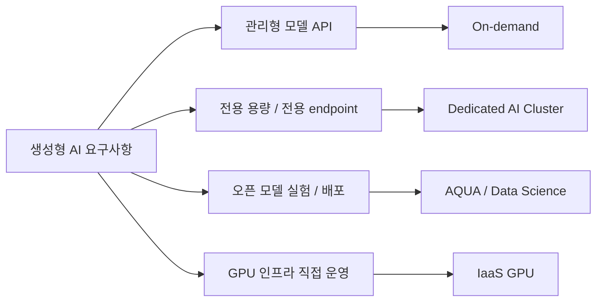
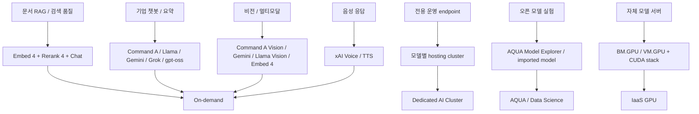

# OCI Generative AI / DAC / AQUA / IaaS GPU 리전 및 모델 가이드 v3

작성일 : 2026-05-31  
github 페이지 웹사이트 :  
https://dontotl.github.io/oci-genai-guide-maintenance/catalog.html  
Private endpoint 가이드 :  
docs/appendix/private-endpoint-architecture.md  
기준 데이터 : 2026-05-31, 출처는 OCI Docs, OCI CLI 조회  
문서 성격 : OCI Gen AI 구성 가이드를 위한 문서입니다.

리전별 스냅샷은 공개 URL `https://dontotl.github.io/oci-genai-guide-maintenance/catalog.html`에서 확인할 수 있습니다.

## 1. 처음 읽는 분을 위한 요약

이 문서는 OCI에서 생성형 AI를 어느 리전과 어느 서비스 방식으로 구성할지 판단하기 위한 고객용 가이드입니다. 핵심 선택지는 `On-demand`, `Dedicated AI Cluster`, `AQUA / Data Science`, `IaaS GPU` 네 가지입니다.

| 먼저 판단할 질문 | 1차 선택 |
|---|---|
| Oracle이 운영하는 모델 API를 바로 호출하면 충분합니까? | On-demand |
| 전용 처리량, 전용 endpoint, 모델별 전용 용량이 필요합니까? | Dedicated AI Cluster |
| 오픈 모델을 실험, 배포, fine-tuning해야 합니까? | AQUA / Data Science |
| GPU 서버, 드라이버, 모델 서버까지 직접 운영해야 합니까? | IaaS GPU |

| 선택 범주 | 대표 사용처 | 먼저 확인할 것 |
|---|---|---|
| On-demand | PoC, RAG, 요약, 챗봇, 검색 보강 | 대상 모델이 원하는 리전에 있는지 확인합니다. |
| Dedicated AI Cluster | 운영 트래픽, 전용 endpoint, 예측 가능한 처리량 | 모델별 dedicated unit, limit, quota, capacity를 확인합니다. |
| AQUA / Data Science | 오픈 모델 평가, 배포, fine-tuning | Data Science GPU shape와 Model Deployment 조건을 확인합니다. |
| IaaS GPU | 자체 모델 서버, vLLM/TGI, CUDA stack 직접 운영 | Compute GPU shape 가시성과 실제 capacity를 별도로 확인합니다. |

| 워크로드 | 대표 모델/기능 조합 | 추천 범주 |
|---|---|---|
| 문서 RAG | `cohere.embed-v4.0`, `cohere.rerank-v4.0-fast/pro`, chat model | On-demand 우선, 운영 처리량은 DAC 검토 |
| 기업 챗봇 | Command A, Llama 4, Gemini 2.5, Grok, gpt-oss | On-demand 우선 |
| 멀티모달 | Command A Vision, Gemini, Llama Vision, Embed 4 | On-demand 우선 |
| 운영 전용 endpoint | 모델별 hosting cluster | Dedicated AI Cluster |
| 오픈 모델 평가와 배포 | AQUA Model Explorer, imported model | AQUA / Data Science |
| 자체 GPU 운영 | vLLM, TGI, custom container, CUDA | IaaS GPU |

Private endpoint는 미지원 리전에 모델이나 GPU capacity를 생성하는 기능이 아닙니다. 지원 리전에 있는 OCI Generative AI endpoint를 고객의 private network에서 접근하는 네트워크 패턴입니다.

## 2. 이번 업데이트 변화 요약

아래 표는 Oracle Docs, Oracle release notes, 공식 모델 문서에서 확인한 서비스/모델 변경만 정리했습니다. OCI CLI 조회 결과와 스냅샷 실행 결과는 11번과 13번에서만 다룹니다.

| 기준일 | 변화 | 고객 영향 |
|---:|---|---|
| 2026-05-29 | Oracle 릴리스 노트에 OCI Responses API를 통해 xAI 모델에서 xAI-compatible tools를 사용할 수 있다고 공지되어 있습니다. | agentic workflow와 외부 도구 호출을 검토할 때 xAI 모델 후보를 포함할 수 있습니다. |
| 2026-05-26 | Oracle 릴리스 노트에 Generative AI Guardrails의 API 버전을 고정하는 변경이 공지되어 있습니다. | Guardrails를 운영 중이면 SDK/API 버전과 배포 자동화의 호환성을 확인해야 합니다. |
| 2026-05-15 | Oracle 릴리스 노트에 xAI Voice 기반 TTS가 추가되었다고 공지되어 있습니다. | 음성 응답 워크로드를 OCI Generative AI 범주에서 검토할 수 있습니다. |
| 2026-05-11 | Oracle 릴리스 노트에 imported model 호환 목록으로 Alibaba Qwen과 Google Gemma 계열이 추가되었다고 공지되어 있습니다. | 이는 관리형 기본 모델 추가가 아니라 import 가능한 모델 범위 확대입니다. 라이선스, import, endpoint 운영 검토가 필요합니다. |
| 2026-05-09 | Oracle 공식 모델 문서에 Cohere Rerank 4의 `cohere.rerank-v4.0-fast`, `cohere.rerank-v4.0-pro`가 설명되어 있습니다. | RAG 검색 품질과 지연 시간 요구사항에 따라 fast/pro 옵션을 나누어 검토할 수 있습니다. |
| 2026-05-09 | Oracle 공식 모델 문서에 Cohere Embed 4의 텍스트+이미지 입력과 configurable embedding dimension 기능이 설명되어 있습니다. | 신규 벡터 검색 설계에서 `cohere.embed-v4.0`을 우선 후보로 검토할 수 있습니다. |
| 2026-05-05 | Oracle 릴리스 노트에 OCI Generative AI가 UAE Central, `me-abudhabi-1`에서 제공되기 시작했다고 공지되어 있습니다. | 중동 리전 설계 시 Abu Dhabi를 GenAI 후보 리전으로 포함할 수 있습니다. |
| 2026-05-01 | Oracle 릴리스 노트에 xAI Grok 4.3을 OCI Generative AI에서 사용할 수 있다고 공지되어 있습니다. | 복잡한 추론, 코드, 장문 맥락 워크로드에서 xAI 후보 모델을 재검토할 수 있습니다. |

이번 기준일에 Oracle 공식 문서에서 별도 확인한 신규 retired 모델 공지는 없습니다. Oracle 문서에 없거나 확인되지 않은 모델 변경은 추정으로 단정하지 않습니다.

## 3. 선택 기준과 용어

| 용어 | 의미 |
|---|---|
| Region | OCI 서비스를 배치하는 지리적 권역입니다. 같은 서비스라도 리전별 모델과 shape가 다를 수 있습니다. |
| On-demand | 고객이 클러스터를 직접 만들지 않고 Oracle 관리형 모델 endpoint를 호출하는 방식입니다. |
| Dedicated AI Cluster, DAC | 특정 모델을 전용 용량으로 hosting하거나 일부 모델을 fine-tuning하기 위한 OCI Generative AI 전용 클러스터입니다. |
| AQUA | OCI Data Science의 AI Quick Actions입니다. 오픈 모델을 빠르게 평가, 배포, fine-tuning하는 경로입니다. |
| Data Science shape | Notebook, Job, Model Deployment에서 선택하는 compute shape입니다. AQUA도 Data Science 리소스와 GPU 조건을 함께 봐야 합니다. |
| IaaS GPU shape | OCI Compute의 GPU instance shape입니다. 모델 서버, 드라이버, 컨테이너, scaling을 고객이 직접 운영합니다. |
| Imported model | Hugging Face 또는 Object Storage에서 가져와 OCI Generative AI에서 배포하는 custom/imported 모델입니다. Oracle 관리형 기본 모델과 다릅니다. |

| 표현 | 정확한 의미 | 의미하지 않는 것 |
|---|---|---|
| 공식 문서상 지원 | Oracle 문서에 리전, 모델, shape 또는 기능이 표시되어 있습니다. | 현재 테넌시에서 즉시 생성 가능하다는 뜻은 아닙니다. |
| CLI에서 보임 | 수집 시점의 API 응답에서 모델 또는 shape가 관측되었습니다. | capacity, quota, limit이 충분하다는 뜻은 아닙니다. |
| shape 가시성 | 해당 리전의 API 응답에 GPU shape가 나타났습니다. | 바로 인스턴스를 만들 수 있다는 뜻은 아닙니다. |
| DAC hosting | 모델을 전용 hosting cluster에 올릴 수 있습니다. | 반드시 fine-tuning 가능하다는 뜻은 아닙니다. |
| fine-tuning 가능 | 해당 서비스와 모델 조합에서 custom model 학습 경로가 있습니다. | 모든 리전, 모든 DAC, 모든 모델에 적용되는 것은 아닙니다. |
| AQUA 가능 | Data Science/AQUA 경로를 검토할 수 있습니다. | 리전별 GPU 재고가 보장된다는 뜻은 아닙니다. |
| capacity 확인 필요 | limit, quota, availability domain별 재고, 예약 가능 여부를 별도 확인해야 합니다. | 문서나 CLI 조회가 실패했다는 뜻은 아닙니다. |

## 4. 4대 서비스 선택 가이드

| 선택지 | 적합한 경우 | 장점 | 주의 사항 |
|---|---|---|---|
| On-demand | 빠르게 API를 붙이고 싶은 PoC 또는 운영 서비스 | 운영 부담이 가장 낮습니다. | 모델별 리전, throttling, 비용을 확인해야 합니다. |
| Dedicated AI Cluster | 예측 가능한 처리량과 전용 endpoint가 필요할 때 | 운영 트래픽 분리와 전용 capacity 설계가 가능합니다. | 모델별 unit과 limit increase가 필요할 수 있습니다. |
| AQUA / Data Science | 오픈 모델 평가, 배포, fine-tuning | Notebook, Job, Model Deployment와 연결됩니다. | Data Science shape와 GPU capacity를 별도로 확인해야 합니다. |
| IaaS GPU | 자체 inference stack, 커스텀 런타임, 연구/학습 | 전체 제어권을 가집니다. | OS, driver, CUDA, 보안, scaling, 장애 대응을 직접 맡습니다. |

## 5. On-demand 모델 활용

On-demand는 가장 먼저 검토할 경로입니다. Oracle 문서의 Models by Region 표와 OCI CLI 조회 결과를 함께 보고, 원하는 모델이 고객의 데이터 위치, 지연 시간, 규제 조건에 맞는 리전에 있는지 확인합니다.

| 모델 범주 | OCI CLI 조회 결과에서 관측된 예 | 대표 사용처 |
|---|---|---|
| Chat / Reasoning | Command A, Llama 4, Gemini 2.5, Grok, gpt-oss | 챗봇, 요약, 코드/추론, agentic task |
| Embedding | `cohere.embed-v4.0`, Embed 3 계열 | RAG 인덱싱, semantic search |
| Rerank | `cohere.rerank-v4.0-fast`, `cohere.rerank-v4.0-pro`, Rerank 3.5 | 검색 결과 재정렬, RAG 품질 개선 |
| Vision / multimodal | Command A Vision, Gemini, Llama Vision, Embed 4 | 이미지+텍스트 이해, 멀티모달 검색 |
| Safety / Guard | Llama Guard, content moderator, prompt injection detector | 입력/출력 안전성 보강 |

On-demand 설계에서는 `지원 리전`, `모델명`, `API operation`, `throttling`, `데이터 이동`, `대체 모델`을 같이 정리해야 합니다. Oracle 문서에 없거나 OCI CLI 조회 결과에서 관측되지 않은 리전은 추정으로 지원한다고 쓰지 않습니다.

## 6. Dedicated AI Cluster 활용

Dedicated AI Cluster는 전용 처리량이나 전용 endpoint가 필요한 운영 워크로드에 적합합니다. Oracle의 `Generative AI Dedicated Cluster Shapes by Region` 문서는 모델별 on-demand/dedicated availability와 hosting cluster shape를 함께 제공합니다. 이 표에서 on-demand 지원, dedicated 지원, cluster shape, unit은 서로 다른 의미이므로 모델별로 확인해야 합니다.

| DAC 판단 항목 | 확인 방법 |
|---|---|
| 모델이 dedicated mode를 지원합니까? | Oracle Models by Region / Dedicated Cluster Shapes by Region을 확인합니다. |
| 어떤 unit이 필요합니까? | 모델 상세 문서의 hosting cluster unit과 required unit을 확인합니다. |
| fine-tuning 대상입니까? | 모델 상세 문서의 fine-tuning cluster 항목을 확인합니다. |
| limit이 충분합니까? | Generative AI service limit과 dedicated unit limit increase 필요 여부를 확인합니다. |
| capacity가 있습니까? | 실제 생성 또는 Oracle capacity 확인 절차가 필요합니다. |

DAC hosting 가능 여부를 fine-tuning 가능 여부로 해석하면 안 됩니다. 예를 들어 Rerank 4와 Embed 4는 검색 보강과 embedding에 중요한 모델이지만, Oracle 문서에 fine-tuning 모델로 명시되어 있지 않으면 fine-tuning 가능하다고 단정하지 않습니다.

## 7. AQUA / Data Science 활용

AQUA / Data Science는 오픈 모델을 빠르게 평가, 배포, fine-tuning하는 경로입니다. OCI Generative AI On-demand처럼 모델 API만 호출하는 방식이 아니라 Data Science Notebook, Job, Model Deployment, Object Storage, shape, 네트워크 구성을 함께 설계합니다.

| 사용 시나리오 | 권장 확인 |
|---|---|
| 오픈 모델 빠른 평가 | AQUA Model Explorer와 지원 모델 목록을 확인합니다. |
| Hugging Face 모델 fine-tuning | AQUA `Ready to Fine Tune` 모델 또는 Data Science Job 경로를 확인합니다. |
| 운영 배포 | Model Deployment shape, autoscaling, endpoint 보안, 로깅을 확인합니다. |
| GPU 필요 | Data Science 지원 shape와 테넌시 limit, quota, capacity를 확인합니다. |

OCI CLI 조회 결과에서 Data Science GPU family가 관측된 리전은 아래와 같습니다. 이 표는 AQUA에서 GPU 재고가 보장된다는 뜻이 아니라 Data Science/AQUA 경로를 검토할 수 있는 shape 가시성 단서입니다.

| 리전 묶음 | Data Science GPU family |
|---|---|
| `us-ashburn-1` | A10, A100, H100, L40S |
| `us-chicago-1` | A10, A100, H100 |
| `us-phoenix-1` | A10, A100 |
| `us-sanjose-1` | A10, H200 |
| `eu-frankfurt-1` | A10, A100, H100 |
| `sa-saopaulo-1` | A10, A100, L40S |
| `ap-osaka-1` | A10, L40S |
| `ca-montreal-1` | A10, A100 |
| `af-johannesburg-1`, `ap-melbourne-1`, `ap-mumbai-1`, `ap-singapore-1`, `ap-sydney-1`, `ap-tokyo-1` | A10 |
| `ca-toronto-1`, `eu-madrid-1`, `eu-milan-1`, `eu-paris-1`, `il-jerusalem-1` | A10 |
| `me-dubai-1`, `me-jeddah-1`, `me-riyadh-1` | A10 |
| `mx-monterrey-1`, `mx-queretaro-1`, `sa-bogota-1`, `sa-santiago-1`, `sa-vinhedo-1`, `uk-london-1` | A10 |

## 8. IaaS GPU 활용

IaaS GPU는 고객이 GPU VM 또는 Bare Metal을 직접 만들고 모델 serving stack을 운영하는 방식입니다. OCI Compute 문서는 shape를 OCPU, memory, network, GPU 등 instance resource template으로 설명합니다. 신규 리전이나 특정 AD에서는 host capacity가 뒤따라 열리는 데 시간이 걸릴 수 있으므로 `ListShapes`로 보인 shape도 실제 capacity와 분리해서 봐야 합니다.

대표 리전의 GPU shape 가시성은 아래와 같습니다. 중복 항목은 제거해 고객용으로 정규화했습니다.

| 리전 | 조회 상태 | 보인 GPU 계열 |
|---|---|---|
| `us-ashburn-1` | 성공 | A10, A100, P100, V100 |
| `us-phoenix-1` | 성공 | A10, A100 |
| `eu-frankfurt-1` | 성공 | A10, A100, P100 |
| `uk-london-1` | 성공 | A10, V100 |
| `ap-seoul-1` | 성공 | A10, A100, V100 |
| `ap-osaka-1` | 성공 | A10, A100, V100 |
| `me-dubai-1` | 성공 | A10 |
| `me-riyadh-1` | 성공 | 없음 |
| `me-abudhabi-1` | 성공 | 없음 |

| 리전 | 보인 shape |
|---|---|
| `us-ashburn-1` | `BM.GPU2.2`, `BM.GPU3.8`, `BM.GPU4.8`, `BM.GPU.A10.4`, `VM.GPU2.1`, `VM.GPU3.1`, `VM.GPU3.2`, `VM.GPU3.4`, `VM.GPU.A10.1`, `VM.GPU.A10.2` |
| `us-phoenix-1` | `BM.GPU.A10.4`, `BM.GPU.B4.8`, `VM.GPU.A10.1`, `VM.GPU.A10.2` |
| `eu-frankfurt-1` | `BM.GPU2.2`, `BM.GPU4.8`, `BM.GPU.A10.4`, `BM.GPU.B4.8`, `VM.GPU2.1`, `VM.GPU.A10.1`, `VM.GPU.A10.2` |
| `uk-london-1` | `BM.GPU3.8`, `BM.GPU.A10.4`, `VM.GPU3.1`, `VM.GPU3.2`, `VM.GPU3.4`, `VM.GPU.A10.1`, `VM.GPU.A10.2` |
| `ap-seoul-1` | `BM.GPU3.8`, `BM.GPU4.8`, `BM.GPU.A10.4`, `VM.GPU3.1`, `VM.GPU3.2`, `VM.GPU3.4`, `VM.GPU.A10.1`, `VM.GPU.A10.2` |
| `ap-osaka-1` | `BM.GPU3.8`, `BM.GPU4.8`, `BM.GPU.A10.4`, `BM.GPU.B4.8`, `VM.GPU3.1`, `VM.GPU3.2`, `VM.GPU3.4`, `VM.GPU.A10.1`, `VM.GPU.A10.2` |
| `me-dubai-1` | `BM.GPU.A10.4`, `VM.GPU.A10.1`, `VM.GPU.A10.2` |
| `me-riyadh-1`, `me-abudhabi-1` | 없음 |

shape가 보인다는 것은 해당 리전에서 즉시 생성 가능하다는 뜻이 아닙니다. 실제 생성 가능 여부는 service limit, quota, capacity, availability domain별 재고를 확인해야 합니다.

## 9. Import / Custom Model 운영

Imported model은 Oracle이 관리형 기본 모델로 제공하는 On-demand 모델과 다릅니다. 고객이 Hugging Face 또는 Object Storage에 있는 호환 모델을 OCI Generative AI에 가져와 endpoint로 배포하는 운영 경로입니다.

| 항목 | 의미 |
|---|---|
| compatible imported model | Oracle 문서에서 import 호환으로 명시한 모델입니다. |
| imported custom model | 고객이 import 작업으로 생성한 모델 자산입니다. |
| endpoint | imported model을 호출하기 위해 만든 endpoint입니다. |
| hosting capacity | imported model을 올릴 shape/unit, limit, capacity입니다. |

2026-05-11 Oracle 릴리스 노트 기준 Alibaba Qwen 계열과 Google Gemma 계열의 import 호환 모델 추가가 공지되었습니다. 이는 해당 모델이 관리형 On-demand 기본 모델로 자동 제공된다는 뜻이 아닙니다. import, 검증, endpoint, 비용, 보안, 모델 라이선스 검토가 필요합니다.

## 10. Fine-tuning 가능 여부

Fine-tuning은 서비스별로 의미가 다릅니다. OCI Generative AI의 관리형 fine-tuning, DAC 기반 custom model hosting, AQUA/Data Science의 open model fine-tuning, IaaS GPU의 self-managed training은 운영 책임이 다릅니다.

| 경로 | 가능 여부 해석 | 주의 사항 |
|---|---|---|
| OCI Generative AI + DAC | 모델 문서에 fine-tuning cluster가 명시된 경우 검토합니다. | DAC hosting 가능이 fine-tuning 가능을 뜻하지 않습니다. |
| On-demand only 모델 | 일반적으로 fine-tuning 대상이 아닐 수 있습니다. | 모델별 문서를 확인해야 합니다. |
| AQUA / Data Science | Ready to Fine Tune 모델 또는 Job 기반 fine-tuning을 검토합니다. | GPU shape, Object Storage, Job 설정, limit 확인이 필요합니다. |
| IaaS GPU | 고객이 직접 fine-tuning stack을 운영할 수 있습니다. | 프레임워크, 드라이버, 데이터 보안, 장애 대응 책임이 고객에게 있습니다. |
| Imported model | 모델별 import 호환성과 배포/운영 조건을 확인합니다. | 관리형 기본 모델과 혼동하지 않습니다. |

OCI CLI 조회 결과의 API 응답 기준으로 `FINE_TUNE` capability가 관측된 모델 예시는 아래와 같습니다. 이 관측은 수집 시점의 응답이며, 신규 설계에서는 반드시 Oracle 모델 상세 문서와 대상 리전의 DAC/fine-tuning 조건을 다시 확인해야 합니다.

| 모델 | 관측 리전 |
|---|---|
| `cohere.command` | `us-chicago-1` |
| `cohere.command-light` | `us-chicago-1` |
| `cohere.command-r-16k` | `eu-frankfurt-1`, `sa-saopaulo-1`, `uk-london-1`, `us-chicago-1` |
| `meta.llama-3-70b-instruct` | `ap-osaka-1`, `eu-frankfurt-1`, `sa-saopaulo-1`, `uk-london-1` |
| `meta.llama-3.1-70b-instruct` | `ap-osaka-1`, `uk-london-1`, `us-chicago-1` |
| `meta.llama-3.3-70b-instruct` | `ap-osaka-1`, `eu-frankfurt-1`, `me-riyadh-1`, `sa-saopaulo-1`, `uk-london-1`, `us-chicago-1` |

## 11. 리전 및 가용성 확인

### 11-1. OCI 조회 성공/실패 상태

2026-05-31 기준 OCI CLI 조회 결과입니다. 공개 리포트에는 원본 출력, 내부 식별자, 보조 연결 확인 값, 계정 범위 식별자, 원본 오류 전문을 포함하지 않았습니다.

| 조회 항목 | 결과 | 고객 관점의 의미 |
|---|---|---|
| 구독 리전 | 43개 READY 리전 확인 | 이 테넌시에서 여러 글로벌 리전을 사용할 수 있습니다. |
| 대표 리전 IaaS GPU shape | 조회 성공 | 대표 리전의 GPU shape 가시성을 확인했습니다. |
| Object Storage 연결 확인 | 성공 | 연결 확인은 성공했지만, 고객 의사결정에 불필요한 내부 값은 제외했습니다. |
| 실패 항목 | 없음 | 이번 대표 리전 조회에서는 실패로 처리한 항목이 없습니다. |

### 11-2. 리전별 해석 기준

| 상태 표현 | 해석 |
|---|---|
| `success` | 해당 항목의 API 조회가 성공했고, 응답 기준으로 모델 또는 shape를 정리했습니다. |
| `failed, success` | 일부 항목은 실패했지만 다른 항목은 성공했습니다. 전체 리전 미지원으로 해석하지 않습니다. |
| `timeout` | 제한 시간 안에 응답을 받지 못했습니다. 네트워크 timeout을 실제 OCI CLI 조회 실패나 서비스 미지원으로 단정하지 않습니다. |
| `없음` | 조회가 성공했으나 해당 범주의 모델 또는 GPU family가 응답에 없었습니다. |

### GenAI 모델이 관측된 리전

아래 표는 OCI CLI 조회 결과에서 GenAI 모델이 관측된 리전만 정리했습니다. 전체 리전 matrix는 본문에 넣지 않고 공개 스냅샷 URL에서 확인하도록 분리했습니다.

| 리전 | 모델 수 | 주요 관측 공급자 | Data Science GPU | IaaS GPU |
|---|---:|---|---|---|
| `us-chicago-1` | 59 | Cohere, Google, Meta, OpenAI, Protect AI, xAI 등 | A10, A100, H100 | A10 |
| `us-ashburn-1` | 42 | Cohere, Google, Meta, OpenAI, Protect AI, xAI | A10, A100, H100, L40S | A10, A100, P100, V100 |
| `ap-osaka-1` | 35 | Cohere, Google, Meta, OpenAI, Protect AI 등 | A10, L40S | A10, A100, V100 |
| `eu-frankfurt-1` | 32 | Cohere, Google, Meta, OpenAI, Protect AI 등 | A10, A100, H100 | A10, A100, P100 |
| `sa-saopaulo-1` | 32 | Cohere, Meta, OpenAI, Protect AI 등 | A10, A100, L40S | A10 |
| `uk-london-1` | 32 | Cohere, Meta, OpenAI, Protect AI 등 | A10 | A10, V100 |
| `us-phoenix-1` | 32 | Cohere, Google, Meta, OpenAI, Protect AI, xAI | A10, A100 | A10, A100 |
| `me-dubai-1` | 19 | Cohere, Meta, OpenAI, Protect AI | A10 | A10 |
| `ap-hyderabad-1` | 17 | Cohere, Google, Meta, OpenAI, Protect AI 등 | 없음 | 없음 |
| `me-riyadh-1` | 16 | Cohere, Meta, OpenAI, Protect AI 등 | A10 | 없음 |
| `me-abudhabi-1` | 8 | Cohere, Meta, OpenAI | 없음 | 없음 |

## 12. 모델 강점과 빠른 추천

| 요구사항 | 빠른 추천 |
|---|---|
| 일반 챗봇과 문서 요약 | On-demand chat model을 먼저 비교합니다. Command A, Llama, Gemini, Grok, gpt-oss를 리전과 기능 기준으로 봅니다. |
| 장문 문서 RAG | `cohere.embed-v4.0`과 `cohere.rerank-v4.0-pro`를 우선 검토합니다. 지연 시간이 더 중요하면 Rerank 4 Fast를 검토합니다. |
| 다국어 검색 | Embed 4 또는 multilingual embedding/rerank 모델을 검토합니다. |
| 복잡한 추론 | Grok, Gemini, gpt-oss, Llama 계열을 비용, 지연 시간, 리전 기준으로 비교합니다. |
| 이미지+텍스트 | Command A Vision, Llama Vision, Gemini, Embed 4를 검토합니다. |
| 음성 응답 | xAI Voice 기반 TTS를 검토하되 리전과 모델 availability를 먼저 확인합니다. |
| 안정적인 운영 처리량 | 대상 모델이 dedicated hosting을 지원하면 DAC를 검토합니다. |
| 오픈 모델 커스터마이징 | AQUA / Data Science 또는 imported model 경로를 검토합니다. |
| 완전한 런타임 통제 | IaaS GPU를 선택하고 capacity와 운영 책임을 별도 산정합니다. |

## 13. 검증 기준과 참고 문서

### 13-1. 검증 기준

| 기준 | 적용 방식 |
|---|---|
| Oracle 공식 문서 우선 | 모델 리전, DAC unit, 모델 기능, private endpoint, Data Science shape, Compute shape 해석은 Oracle 공식 문서를 1순위로 사용했습니다. |
| OCI CLI 조회 결과 사용 | 2026-05-31 기준 사전 조회 결과를 사용했습니다. 이 문서 작성 과정에서 OCI CLI 실조회를 다시 실행하지 않았습니다. |
| 리전별 모델과 shape 가시성 | 리전별 GenAI 모델, Data Science/AQUA shape, IaaS GPU shape 가시성은 OCI CLI 조회 결과의 API 응답 기준으로 정리했습니다. |
| 내부 정보 제외 | 계정 식별자, 내부 식별자, 실행 환경 정보, 원본 출력 위치, 원본 오류 전문을 제외했습니다. |
| capacity 비단정 | `CLI에서 보임`, `공식 문서상 지원`, `capacity 확인 필요`를 분리했습니다. |
| private endpoint 비단정 | private endpoint를 미지원 리전의 모델/GPU 생성 수단으로 쓰지 않았습니다. |

### 13-2. 사용한 주요 공식 문서 범주

| 공식 문서 범주 | 사용 목적 |
|---|---|
| OCI Generative AI Models by Region / Dedicated Cluster Shapes by Region | 모델별 on-demand/dedicated 여부와 DAC unit 해석에 사용했습니다. |
| OCI Generative AI release notes | 2026년 5월 신규 기능, 리전 추가, import compatible model 추가 확인에 사용했습니다. |
| OCI Generative AI model detail 문서 | Cohere Embed 4, Rerank 4, fine-tuning/hosting 구분에 사용했습니다. |
| OCI Generative AI imported model 문서 | imported model과 관리형 기본 모델을 구분하는 데 사용했습니다. |
| OCI Generative AI private endpoint 문서 | private endpoint가 지원 리전 endpoint를 private network로 접근하는 패턴임을 확인하는 데 사용했습니다. |
| OCI Data Science AI Quick Actions 문서 | AQUA / Data Science 경로 해석에 사용했습니다. |
| OCI Data Science Supported Compute Shapes 문서 | Data Science GPU shape 해석에 사용했습니다. |
| OCI Compute Shapes 문서 | IaaS GPU shape와 `ListShapes`, capacity 해석에 사용했습니다. |

### 13-3. 공식 문서 URL

- `https://docs.oracle.com/en-us/iaas/Content/generative-ai/model-dac-endpoint-regions.htm`
- `https://docs.oracle.com/en-us/iaas/releasenotes/services/generative-ai/index.htm`
- `https://docs.oracle.com/en-us/iaas/releasenotes/generative-ai/compatible-imported-models-may-11-2026.htm`
- `https://docs.oracle.com/en-us/iaas/Content/generative-ai/cohere-rerank-4-0.htm`
- `https://docs.oracle.com/en-us/iaas/Content/generative-ai/cohere-embed-4.htm`
- `https://docs.oracle.com/en-us/iaas/Content/generative-ai/imported-alibaba-models.htm`
- `https://docs.oracle.com/en-us/iaas/Content/generative-ai/imported-google-models.htm`
- `https://docs.oracle.com/en-us/iaas/Content/generative-ai/private-endpoint.htm`
- `https://docs.oracle.com/en-us/iaas/Content/data-science/using/ai-quick-actions-about.htm`
- `https://docs.oracle.com/en-us/iaas/Content/data-science/using/supported-shapes.htm`
- `https://docs.oracle.com/en-us/iaas/Content/Compute/References/computeshapes.htm`

### 13-4. 함께 볼 로컬 자료

- catalog 해석 기준: `docs/catalog-notes.md`
- 변경 이력: `docs/CHANGELOG.md`
- 문서 인덱스: `docs/INDEX.md`
